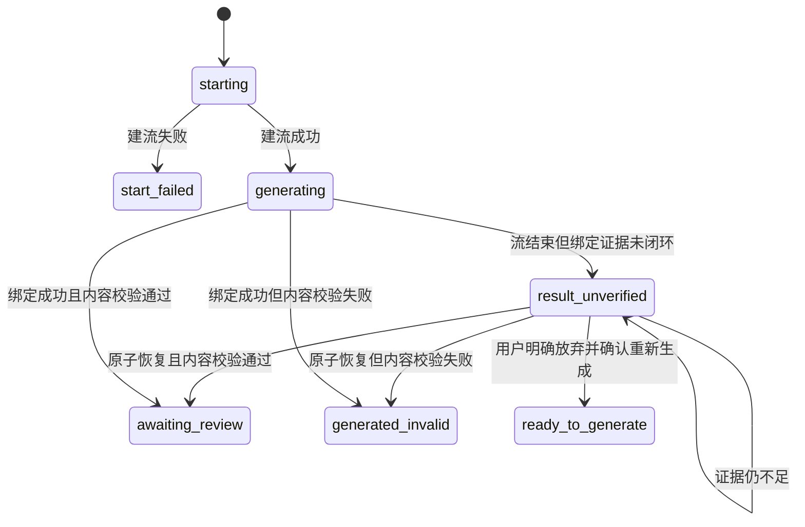

# 专家团结果绑定与恢复设计

## 1. 问题定义

专家团一次生成包含四个相互独立的事实：

1. 启动：执行流是否成功建立；
2. 生成：模型是否返回并持久化了非空结果；
3. 绑定：结果是否能用 `session_id + stream_id + turn_id + assistant_message_index` 唯一归属当前专家团阶段；
4. 验收：该结果是否满足当前阶段的业务产出契约。

当前 Gateway 主链已完成前两项，但没有写 Turn Journal 的 `assistant_started/completed` 事件，导致第 3 项失败。轮询又把“结果绑定失败”错误落成 `start_failed` 并清空执行身份，于是 UI 显示“启动失败”，同时诱导用户重复生成。

## 2. 不可违背的约束

- 聊天区有文本，不等于专家团阶段已完成。
- `start_failed` 只表示流在建立前或建立时失败，不得承载生成后的对账异常。
- 结果绑定必须使用稳定身份，不得恢复“取最新 assistant”或仅按时间窗口猜测。
- 生成后的对账异常必须保留 stream、turn、stage、attempt 和会话证据，且默认操作不得再次调用模型。
- 内容绑定成功与内容校验成功必须分开；绑定成功后允许进入 `generated_invalid`，但不能回写为启动失败。
- 所有恢复操作必须幂等；证据不唯一时宁可停在待恢复，也不能认领错误结果。

## 3. 方案

### 3.1 主链闭环

Gateway 成功写回会话时，与本地 Streaming 主链保持相同生命周期：

1. 计算最终 assistant 消息索引；
2. 在会话保存前写 `assistant_started`；
3. 保存会话；
4. 保存成功后写 `completed`，包含同一 `stream_id / turn_id / assistant_message_index`；
5. 再发布 `done / stream_end`。

Turn Journal 写入失败不得伪装成生成失败；Run Journal 与会话仍作为恢复证据。

### 3.2 独立异常态

新增 `result_unverified`：表示执行已经结束，但结果绑定证据尚未闭环。

- 保留全部执行身份；
- UI 文案为“结果待核验”，说明已生成内容不会被自动重做；
- 主操作为“重新核验结果”，只做本地证据对账，不调用模型；
- 只有明确无法恢复且用户主动选择时，才允许重新生成。

### 3.3 安全恢复

恢复按强到弱使用证据：

1. Turn Journal 的同 stream/turn `completed + assistant_message_index`；
2. 保存前的同 stream/turn `assistant_started` 写回意图，且消息索引、assistant 摘要、相邻 user 摘要与当前持久化会话完全一致；
3. Run Journal 只作为诊断证据，本轮不作为自动认领依据。

任何多候选、索引越界、角色不匹配、正文不一致、终态冲突都拒绝恢复并记录原因。

新执行的 `submitted` 事件额外保存 `expert_team_run_id / stage_id / attempt / execution_start_id`。旧 `start_failed` 已清空稳定身份，禁止后台自动认领；仅保留结果查看和显式重新生成。未来若实现人工认领，必须先展示候选摘要并记录人工审计事件。

Turn Journal 的 lifecycle append 必须逐次 fail-open：单次账本写入失败只能降级可恢复性，不能阻断已生成结果的会话保存。若 `assistant_started` 与 `completed` 都失败，则停在 `result_unverified`，不得猜测认领。

### 3.4 状态机

## 4. 影响面

- Gateway 会话写回和 Turn Journal 生命周期；
- 专家团本地执行轮询与结果解析；
- 专家团运行状态、视图文案和操作映射；
- 既有异常 run 的兼容恢复；
- Gateway、状态机、路由、Presenter/UI 与桌面端端到端测试。

## 5. 不采用的方案

- **直接隐藏“启动失败”**：只改文案，状态机仍错误且会重复扣费。
- **取最后一条 assistant**：可能把用户并发对话或下一轮回答认领为专家团产物。
- **失败后自动重试生成**：制造重复结果与额外模型消耗，且根因未消除。
- **直接手改当前 run JSON**：无法沉淀为产品能力，也绕过幂等和证据校验。
