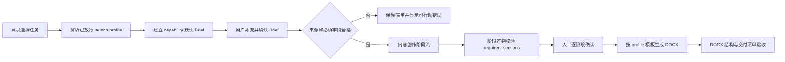

# 专家团全部内容任务可信开放设计

## 1. 目标与问题定义

内容创作专家团当前只有“工作汇报”具备已放行的文档能力和启动配置，其余“会议纪要、通知通报、方案说明、总结计划、材料润色”虽然出现在目录中，但因缺少完整能力合同而显示“暂未开放”。同时，任务选择弹窗使用固定最大高度和 `overflow: hidden`，正文超高后会把底部“发起专家团任务”裁掉，形成主流程 P0 阻断。

本次变更需要同时解决两个事实问题：

1. 主操作在支持的窗口高度下必须始终可见、可聚焦、可点击；
2. 五个任务必须具备真实可执行、可恢复、可渲染、可验收的端到端合同，不允许只删除“暂未开放”标签。

## 2. 不可违背的约束

- 仅修改 `expert-team-standalone-core` worktree 中的专家团代码、页面、测试和运行任务。
- 目录可用性继续由服务端已验证的 capability + launch profile 推导，前端不得自行把未放行任务伪装为可用。
- 五类任务共享现有内容创作阶段编排，但输入规格、来源要求、必备章节和交付模板分别由文种能力声明。
- `required_sections` 必须从 capability 默认值进入 Brief，经过确认、阶段提示、阶段产物和 DOCX 交付校验，禁止仅停留在页面展示层。
- “材料润色”必须使用 `task_mode=polish`，且至少绑定一份可读取的用户资料；没有原文不得启动。
- 模型生成失败、阶段结果不合格、恢复待核验和 DOCX 渲染失败继续使用现有显式状态，不得自动重复调用模型。
- 现有“工作汇报”和“专题报告”合同、恢复语义与交付结果必须保持兼容。

## 3. 用户体验设计

### 3.1 弹窗布局

采用用户确认的 A 方案：弹窗本体改为三行网格。

```text
┌─ 固定标题区 ─────────────────────┐
├─ minmax(0, 1fr) 可滚动内容区 ────┤
│  团队能力 / 成员 / 六个任务 / 诉求 │
├─ 固定操作区：取消｜发起专家团任务 ─┤
└──────────────────────────────────┘
```

- 弹窗：`grid-template-rows: auto minmax(0, 1fr) auto`，保留视口内最大高度。
- 内容区：`min-height: 0; overflow-y: auto`，长内容只在中间滚动。
- 操作区：保持不参与内容滚动，使用不透明背景和上边框；主按钮始终可见。
- 小窗口下维持按钮可触达和清晰焦点样式；不通过缩小字号隐藏问题。
- 六项任务全部可选择，不再显示“暂未开放”；当前选择态、键盘焦点态和不可提交原因必须可区分。

### 3.2 发起前反馈

- 普通创作任务缺少必填 Brief 字段时，阻止提交并定位第一个错误字段。
- 材料润色没有合格原文资料时，主按钮保持可见，但提交后在资料区域和按钮附近给出明确错误：“请先添加需要润色的原始材料”。
- 不使用无反馈的禁用按钮承载未知原因；服务端错误显示中文可行动信息。

## 4. 能力合同设计

### 4.1 能力与模板映射

| capability_id | document_type | task_mode | standalone template |
| --- | --- | --- | --- |
| `content-meeting-minutes` | `meeting_minutes` | `create` | `standalone-meeting-minutes` |
| `content-notice` | `notice` | `create` | `standalone-office-material` |
| `content-plan` | `plan` | `create` | `standalone-office-material` |
| `content-summary-plan` | `summary_plan` | `create` | `standalone-office-material` |
| `content-polish` | `other_office_material` | `polish` | `standalone-office-material` |

实际审查证明既有 `meeting-minutes` 和 `general-proposal` 属于旧的企业/演示合同：适配器会注入固定日期、客户、公司、密级和责任事项，且包含 `wps_visual` 门禁，不能用于 standalone 交付。因此新增两个共享同一安全渲染结构的单机模板包：会议纪要使用 `standalone-meeting-minutes`，其余四类使用 `standalone-office-material`。二者均声明 `contractProfile=standalone`，只渲染用户确认的标题、章节、表格和图片，不生成任何业务事实或企业元数据。旧模板保持不变，避免影响现有调用方。

### 4.2 Brief 字段与必备章节

所有任务继承公共字段：准确标题、文档用途、阅读对象、使用场景。

| 任务 | 专属必填字段 | `required_sections` |
| --- | --- | --- |
| 会议纪要 | 会议时间、会议地点、主持人、参会范围 | 会议基本情况、议定事项、责任分工、后续跟踪 |
| 通知通报 | 发文单位、执行时间或截止时间 | 背景与总体要求、通知事项、时间安排、责任分工、报送要求 |
| 方案说明 | 实施周期、牵头单位 | 目标、现状与问题、主要措施、进度安排、保障机制 |
| 总结计划 | 总结周期、责任单位 | 阶段性工作总结、成效与亮点、问题与不足、下一步工作计划 |
| 材料润色 | 润色目标、表达边界 | 润色后正文、修改说明 |

材料润色的“润色后正文”必须保持原文事实、数字、专名和明确结论；“修改说明”只概括结构与表达调整，不虚构事实。若用户在 Brief 中增加章节，最终结构按确认后的 `required_sections` 完整保留。

### 4.3 来源策略

- 会议纪要、通知通报、方案说明、总结计划允许零附件启动；缺失事实必须使用“待补充”或“需人工确认”标记。
- 材料润色 `minimum_ready=1`，只允许对已绑定原文进行处理。
- 五类任务默认 `provided_only`，不得自行引入未授权外部事实。
- 服务端以 capability 的 `source_requirement` 作为唯一判断源；前端提示与服务端校验不得维护两套规则。

## 5. 启动配置与数据流

为五类任务各增加一个 server-owned launch profile，均绑定内容创作专家团和 `CONTENT_PHASES`，并与对应 capability 的 `document_type / task_mode / render_template_id / brief_schema / source_requirement / content_constraints` 做完全一致校验。



目录层不新增硬编码 available 开关：catalog 仍通过已验证 profile 查找匹配的 `team_id + intake_example_id`。任一 capability 或 profile 结构不完整、映射冲突或模板不匹配时，任务必须 fail closed 为不可启动，并返回具体合同错误。

## 6. 生成与交付语义

- 五类任务沿用内容创作专家团的计划、素材整理、富内容初稿、审稿打磨和系统交付阶段。
- 阶段提示继续由确认后的 Brief 生成，并逐项要求原样包含 `required_sections`。
- 阶段产物解析器和交付校验不按 UI 标签猜测文种，只读取运行时冻结的 capability/Brief。
- DOCX 交付前校验所有必备章节均存在且非空；材料润色额外校验存在原始来源绑定。
- 现有幂等启动、权威 attempt、结果绑定和恢复逻辑不改变；重复点击不得创建第二个权威阶段执行。

## 7. 错误处理与兼容

- 未知 profile：返回“当前任务类型不可启动”，目录不展示为可用。
- Brief 字段缺失：返回字段级错误，页面滚动并聚焦首个错误。
- 材料润色缺少来源：在模型调用前失败，不创建阶段 attempt。
- 模板不匹配或模板不存在：停止在交付失败，可恢复重新渲染，不重复生成正文。
- 必备章节缺失：进入现有生成结果不合格/待人工处理路径，不得伪装为已完成。
- 老 run 使用已冻结的 profile/Brief 继续恢复；新 registry 不反向改写历史任务。

## 8. 测试与验收

### 8.1 测试先行

先增加失败测试，再做最小实现：

1. capability registry：五类组合可解析，字段、来源策略、章节和模板精确匹配；非法组合继续拒绝。
2. launch profiles：五个 profile 顺序稳定、无重复绑定，并与 capability 完全一致。
3. catalog：六个内容任务均可选，且不存在“暂未开放”标签或 disabled reason。
4. Brief：各任务必填字段校验；材料润色无来源时必然失败，有来源时通过。
5. required sections：从默认 Brief 到确认、提示、阶段产物、交付清单和 DOCX 的完整传播与缺失拒绝。
6. DOCX Engine：`standalone-meeting-minutes` 和 `standalone-office-material` 对五类任务完成 schema、渲染、自检及 ZIP/DOCX 结构验证，并证明产物不含旧模板注入内容。
7. 回归：工作汇报、专题报告、恢复、重复启动和交付重试测试保持通过。

### 8.2 前端与桌面验收

- 自动化断言标题区、内容滚动区、固定操作区的 DOM/CSS 合同。
- 在当前用户截图等价窗口及更小窗口验证：无需滚动整个弹窗即可看见“发起专家团任务”。
- 键盘 Tab 可到达六个任务、原始诉求、取消和发起按钮，焦点可见。
- 真实 Electron 中逐项验证五个入口、Brief 字段、提交错误与恢复入口。
- 在 Provider 可用时，五类任务分别完成一次从发起到 DOCX 交付的真实流程，并打开产物检查标题、章节、正文和修改说明；Provider 不可用的项目必须明确标记“未验证”，不能以单元测试替代。

## 9. 完成标准

同时满足以下条件才可声明本分支完成：

- 六个内容任务在目录中可见、可发现、可选择；
- 主按钮在目标窗口尺寸中始终可见且可操作；
- 五个新增 capability/profile 均通过服务端合同测试；
- 五类 `required_sections` 和来源要求完成全链路测试；
- 两个复用模板完成实际渲染和 DOCX 结构检查；
- 专家团相关回归测试通过；
- 输出中文《前端 UX QA 报告》，将未执行的真实桌面、视觉、可访问性或 Provider 验收明确列为“未验证”；
- Git 提交仅包含本 worktree 的专家团设计、代码、测试和相关运行证据。

## 10. 不采用的方案

- **只删除“暂未开放”**：会暴露没有启动配置的死入口。
- **五项全部伪装成工作汇报**：输入字段、章节和模板语义错误，属于不可接受的假开放。
- **继续复用旧 `meeting-minutes` / `general-proposal`**：实测会注入固定日期、客户、公司、密级和责任事项，也会错误带入企业版视觉门禁。
- **立即复制五套 DOCX 模板**：重复维护成本高；两个 standalone 安全模板已覆盖会议纪要与通用办公材料两种结构族。
- **材料润色允许无原文启动**：无法保证“保持原意”，也无法验收事实是否被篡改。
