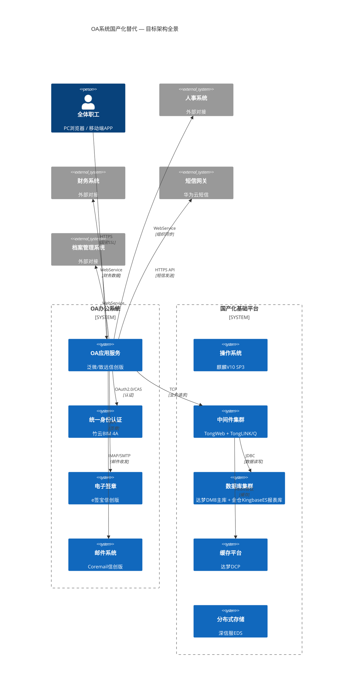
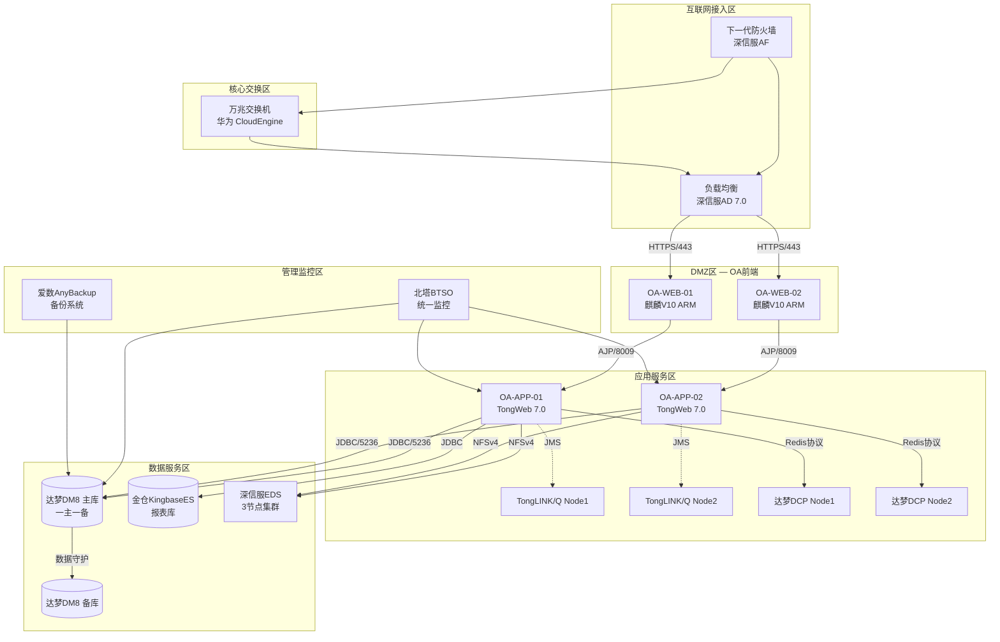
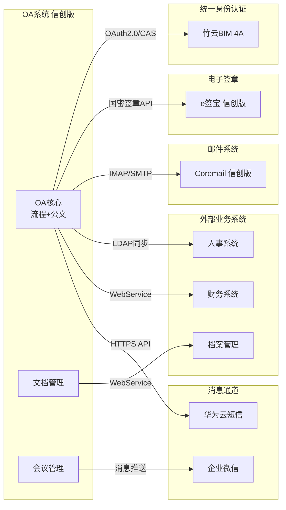
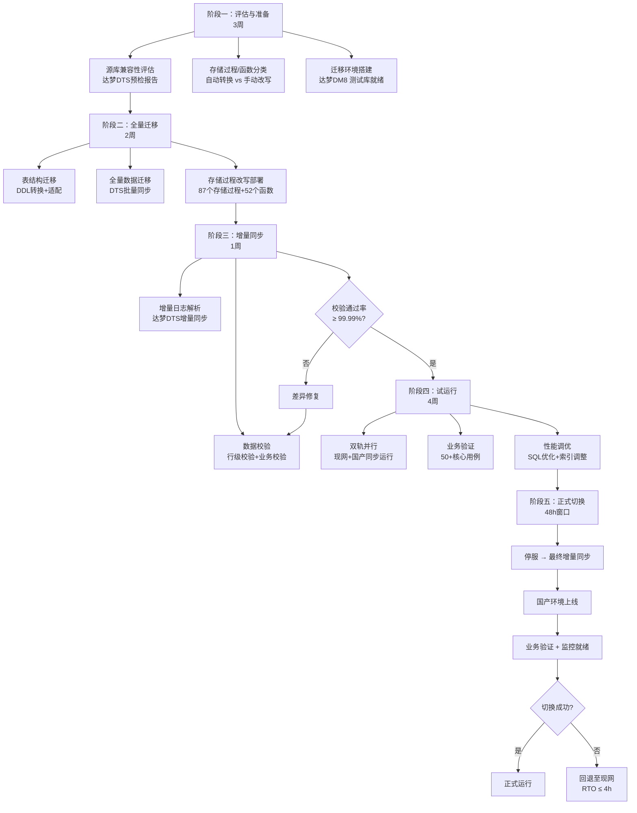
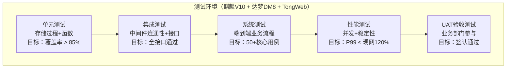
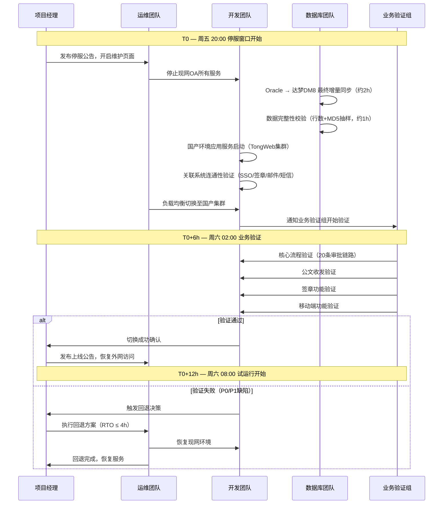

# OA系统及关联系统国产化替代详细设计方案

---

**文档编号**: XC-OA-DESIGN-2026-001
**版本**: V1.0
**密级**: 内部
**日期**: 2026年7月
**编制**: taiji Agent
**状态**: 初稿（待评审）

---

## 1. 项目概述

### 1.1 项目背景

根据国家信息技术应用创新（信创）战略部署要求，党政机关及关键行业需在2027年前完成核心业务系统的国产化替代。OA系统作为日常办公的核心枢纽，与统一身份认证、电子签章、邮件系统、档案管理、短信网关等10余套关联系统深度耦合，其替代工程具有"牵一发而动全身"的特点。

本项目旨在对现网OA系统及关联系统实施全技术栈国产化替代，覆盖操作系统、中间件、数据库三大基础软件，同步完成业务数据迁移和关联系统对接改造，最终实现OA系统在国产技术栈上的稳定运行。

### 1.2 替代范围

| 序号 | 替代层级 | 现网技术 | 国产替代方案 | 替代策略 |
|:---:|:---|:---|:---|:---|
| 1 | CPU/服务器 | Intel Xeon Gold 6248 × 4节点 | 鲲鹏920（ARM）或海光C86 7380（x86） | 新购国产服务器，利旧网络设备 |
| 2 | 操作系统 | Red Hat Enterprise Linux 7.9 / Windows Server 2016 | 麒麟V10 SP3（ARM/x86双架构适配） | 整体替换，应用需重新编译适配 |
| 3 | 数据库 | Oracle 19c RAC（主库）+ SQL Server 2017（报表库） | 达梦DM8（主库）+ 人大金仓KingbaseES V8（报表库） | 结构迁移+数据迁移+存储过程改写 |
| 4 | 应用中间件 | Apache Tomcat 9 + WebLogic 12c | 东方通TongWeb 7.0 + 金蝶Apusic AS 10 | 部署包适配，配置映射迁移 |
| 5 | 消息中间件 | RabbitMQ 3.8 + ActiveMQ 5.16 | TongLINK/Q 9.0 + RocketMQ 5.1 | 接口协议适配，客户端SDK替换 |
| 6 | 缓存 | Redis 6.2 集群 | 达梦DCP（分布式缓存平台） | 数据结构兼容性适配 |
| 7 | 负载均衡 | Nginx 1.20（开源版，社区支持） | 深信服AD 7.0 | 四七层配置迁移，会话保持策略重配 |
| 8 | OA应用 | 泛微 e-cology 9.0（通用版） | 泛微 e-cology 信创版 / 致远 A8+ 信创版 V8.1 | 应用升级或迁移，流程模板导出导入 |
| 9 | 统一身份认证 | CAS 6.x + LDAP（OpenLDAP 2.4） | 竹云 BIM 4A 平台 6.0 | 账号同步对接、OAuth2/CAS协议适配 |
| 10 | 电子签章 | iSignature（签章服务器） | e签宝信创版 / 法大大信创版 | API接口对接、印章数据迁移 |
| 11 | 邮件系统 | Microsoft Exchange 2016 | Coremail 信创版 6.0 / 安宁邮件系统 | IMAP/POP3协议兼容，邮件数据迁移 |
| 12 | 文件存储 | NAS（NetApp FAS2750，NFS/CIFS） | 深信服EDS 分布式存储 | 文件迁移+共享路径重映射 |
| 13 | 短信网关 | 阿里云短信 SDK v3.0 | 华为云短信 / 梦网科技 | SDK替换，模板迁移 |
| 14 | 数据库备份 | Oracle RMAN + NetBackup | 达梦DMRMAN + 爱数AnyBackup | 备份策略重配 |
| 15 | 监控运维 | Zabbix 5.4（社区版） | 北塔软件 BTSO / 泽众ZCloud | 监控指标重定义，告警规则迁移 |

### 1.3 替代原则

- **业务不中断优先**：切换窗口控制在周末48小时内，核心审批流程不中断超过4小时
- **数据完整性优先**：全量数据校验通过率 ≥ 99.99%，单表不一致行数 ≤ 3 行
- **性能不退化**：核心接口（发起审批、待办列表、公文查询）响应时间不超过现网的120%
- **安全合规优先**：通过等保2.0三级测评，密码算法替换为国密SM2/SM3/SM4

### 1.4 术语表

| 术语 | 全称/说明 |
|:---|:---|
| 信创 | 信息技术应用创新 |
| DM8 | 达梦数据库管理系统 V8 |
| KingbaseES | 人大金仓数据库管理系统 V8 |
| TongWeb | 东方通应用服务器中间件 |
| DCP | 达梦分布式缓存平台 |
| DMRMAN | 达梦数据恢复管理器 |
| 国密 | 国家商用密码算法（SM2/SM3/SM4） |

---

## 2. 总体架构设计

### 2.1 目标架构全景图（C4Context）



### 2.2 网络部署拓扑



### 2.3 关联系统对接全景



---

## 3. 核心替代方案

### 3.1 选型分析矩阵

OA应用选型涉及"平滑迁移"与"能力升级"的权衡。以下为关键维度的量化评估：

| 评估维度 | 权重 | 泛微 e-cology 信创版 | 致远 A8+ 信创版 | 蓝凌 MK-PaaS 信创版 | 评估说明 |
|:---|:---:|:---:|:---:|:---:|:---|
| 国产化兼容性 | 20% | 95 | 92 | 90 | 对达梦DM8/金仓/麒麟的适配成熟度 |
| 现网迁移平滑度 | 20% | 98 | 60 | 55 | 现有流程模板、表单、数据是否可继承 |
| 信创中间件支持 | 10% | 90 | 88 | 85 | TongWeb/TongLINK/Q官方兼容认证 |
| 国密算法支持 | 10% | 95 | 90 | 88 | SM2/SM3/SM4端到端覆盖 |
| 电子签章对接 | 10% | 90 | 85 | 85 | e签宝/法大大预制连接器 |
| 开放性与API | 10% | 80 | 90 | 95 | 低代码扩展、REST API完整性 |
| 移动端体验 | 10% | 85 | 88 | 90 | 企业微信/钉钉/飞书集成深度 |
| 厂商服务能力 | 5% | 90 | 88 | 85 | 本地化支持、信创项目经验 |
| 许可证成本 | 5% | 75 | 80 | 78 | 信创版授权+年度运维费 |
| **加权总分** | **100%** | **91.1** | **81.2** | **77.4** | 建议：若现网为泛微 → 平滑升级；若新建 → 三选一综合评估 |

**注**：以上分值为基于公开资料的初步评估，最终评分需结合POC实测和厂商方案评审确定。如现网OA为泛微 e-cology，建议优先选择泛微信创版以最大化迁移平滑度。

### 3.2 数据库选型对比

| 对比维度 | 达梦 DM8 | 人大金仓 KingbaseES V8 | 南大通用 GBase 8s | 推荐 |
|:---|:---|:---|:---|:---|
| Oracle兼容度 | ★★★★★（95%+兼容） | ★★★★（85%+兼容） | ★★★（70%+兼容） | 达梦 |
| SQL Server兼容度 | ★★★ | ★★★★★ | ★★★ | 金仓 |
| 存储过程自动转换率 | 78.7%（工具预估） | 72.3%（工具预估） | 60%以下 | 达梦 |
| 高可用方案 | 数据守护+读写分离 | 集群版+主备流复制 | HAC集群 | 均可用 |
| 信创资质 | 安可目录首批 | 安可目录首批 | 安可目录首批 | 均满足 |
| 与泛微/致远适配 | 官方认证 | 官方认证 | 需定制 | 达梦/金仓 |
| 国密支持 | SM2/SM3/SM4原生 | SM2/SM3/SM4原生 | SM2/SM3/SM4原生 | 均满足 |

**推荐方案**：主库采用达梦DM8（Oracle语法高度兼容，存储过程转换率高），报表库采用金仓KingbaseES V8（SQL Server兼容度优，报表SQL迁移工作量小）。

### 3.3 中间件高可用架构

```
                   ┌──────────────┐
                   │  深信服AD    │
                   │  (主备模式)  │
                   └──────┬───────┘
                          │ VIP漂移
            ┌─────────────┼─────────────┐
            │             │             │
       ┌────▼────┐  ┌────▼────┐  ┌────▼────┐
       │TongWeb  │  │TongWeb  │  │TongWeb  │
       │Node-1   │  │Node-2   │  │Node-N   │
       │(麒麟ARM)│  │(麒麟ARM)│  │(麒麟ARM)│
       └────┬────┘  └────┬────┘  └────┬────┘
            │             │             │
            └─────────────┼─────────────┘
                          │ JDBC连接池
              ┌───────────┴───────────┐
              │                       │
         ┌────▼────┐            ┌────▼────┐
         │达梦DM8  │  数据守护  │达梦DM8  │
         │ 主库    │◄──────────►│ 备库    │
         │(麒麟ARM)│  自动切换  │(麒麟ARM)│
         └─────────┘            └─────────┘
```

**说明**：TongWeb 采用集群模式，通过深信服AD实现会话保持和故障转移。达梦DM8采用数据守护（DataWatch）实现主备实时同步，故障切换时间RTO ≤ 30秒。

---

## 4. 中间件与组件方案

### 4.1 组件替换映射表

| 序号 | 组件类型 | 现网技术 | 国产替代 | 版本 | 兼容策略 | 风险等级 | 验证方法 |
|:---:|:---|:---|:---|:---|:---|:---:|:---|
| 1 | Servlet容器 | Tomcat 9.0.x | 东方通TongWeb | 7.0 | war包直接部署，需调整TongWeb私有配置 | 低 | 部署后全接口冒烟测试 |
| 2 | EJB容器 | WebLogic 12c | 金蝶Apusic AS | 10.0 | EJB 3.1兼容，需重新打包 | 中 | EJB组件逐个验证 |
| 3 | JMS消息 | RabbitMQ 3.8 | TongLINK/Q | 9.0 | JMS 2.0标准API，客户端SDK替换 | 中 | 消息收发+重连测试 |
| 4 | JMS消息 | ActiveMQ 5.16 | RocketMQ | 5.1 | Topic/Queue模型兼容，SDK替换 | 中 | 延迟消息+顺序消息验证 |
| 5 | 缓存 | Redis 6.2 | 达梦DCP | 2.0 | Redis协议兼容，哨兵/集群模式对应 | 中 | 缓存命中率+主从切换 |
| 6 | 连接池 | HikariCP 4.0 | 达梦Druid | 1.2 | 达梦JDBC驱动替换，连接池参数调整 | 低 | 连接池压测 |
| 7 | 工作流引擎 | 泛微原生 | 泛微信创版原生 | 最新 | 流程模板XML导出→导入 | 低 | 核心流程回归测试 |
| 8 | 报表引擎 | 帆软FineReport 10 | 帆软FineReport 信创版 | 11.0 | 报表模板直接迁移 | 低 | 50+报表全量对比 |
| 9 | SSL/TLS | OpenSSL 1.1 | 国密SSL（GmSSL） | 3.0 | 国密自适应双证书 | 中 | HTTPS+国密双向验证 |
| 10 | 定时任务 | Quartz 2.3 | 达梦DMJob | DM8内置 | SQL改写为达梦语法 | 低 | 定时任务执行日志核查 |

### 4.2 中间件集成验证清单

| 验证项 | 验证场景 | 预期结果 | 实测结果 | 状态 |
|:---|:---|:---|:---|:---:|
| TongWeb + DM8 JDBC | 100并发持续1h读写 | 无连接泄漏，响应P99 < 3s | — | 待测 |
| TongLINK/Q 消息可靠性 | 发送10,000条消息，主节点宕机 | 消息零丢失，从节点自动接管 | — | 待测 |
| 达梦DCP故障切换 | 主节点kill -9，观察读写恢复 | 30s内恢复读写，无数据丢失 | — | 待测 |
| 国密SSL双向验证 | 浏览器导入国密证书，访问OA | 建立GM/T 0024通道，页面正常加载 | — | 待测 |
| Apusic AS EJB调用 | WebLogic EJB → Apusic EJB跨容器调用 | JNDI查找成功，方法返回值一致 | — | 待测 |

---

## 5. 数据迁移方案

### 5.1 迁移范围与规模

| 迁移对象 | 现网规模 | 目标规模 | 迁移工具 | 预估时长 |
|:---|:---|:---|:---|:---|
| 数据库表 | 1,247 张 | 1,180 张（67张废弃表不迁移） | 达梦DTS + 金仓KDTS | — |
| 数据总量 | 1,865 GB | — | — | — |
| 存储过程 | 412 个 | 需改写约 87 个（21.1%） | 手动改写 + 达梦SPC工具 | 15人天 |
| 函数 | 236 个 | 需改写约 52 个（22.0%） | 手动改写 | 10人天 |
| 触发器 | 48 个 | 需改写约 15 个（31.3%） | 手动改写 | 5人天 |
| 序列 | 312 个 | 全部迁移 | DTS自动迁移 | — |
| 视图 | 85 个 | 需改写约 28 个（32.9%） | 手动改写 | 8人天 |
| 索引 | 2,800+ | 全部重建 | DTS自动迁移 | — |
| 附件文件 | 4,520,000+ 个 / 1.2 TB | 全量迁移 | rsync + 深信服EDS迁移工具 | 4小时（千兆网） |
| 流程实例（历史） | 3,200,000+ 条 | 近3年在线，其余归档 | 应用层导出/导入 | 8小时 |
| 消息队列数据 | 持久化消息约 12 GB | 不迁移（新系统重新消费） | — | — |

**注**：存储过程/函数自动转换率约78.7%，为达梦DTS工具的理论值，实际以测试环境验证为准。以上数据量基于现网OA运行5年的统计快照（2026年6月），最终以停机窗口前的全量统计为准。

### 5.2 迁移五阶段流程



### 5.3 存储过程改写典型场景

| 场景 | Oracle语法 | 达梦DM8语法 | 改写难度 |
|:---|:---|:---|:---:|
| 分页查询 | `ROWNUM` / `OFFSET FETCH` | `LIMIT ... OFFSET ...` 或 `ROWNUM`（兼容） | 低 |
| 日期函数 | `SYSDATE`, `TO_DATE` | `SYSDATE`, `TO_DATE`（兼容） | 低 |
| 分析函数 | `ROW_NUMBER() OVER(...)` | 完全兼容 | 无 |
| 层次查询 | `CONNECT BY ... START WITH` | `CONNECT BY` 支持，部分语法差异 | 中 |
| 包/存储过程 | `CREATE OR REPLACE PACKAGE` | 不支持Oracle PACKAGE，需拆分为独立过程 | 高 |
| 自治事务 | `PRAGMA AUTONOMOUS_TRANSACTION` | 不支持，需使用子会话模拟 | 高 |
| MERGE INTO | `MERGE INTO ... USING ...` | 兼容但语法微调 | 低 |
| 动态SQL | `EXECUTE IMMEDIATE` | 完全兼容 | 无 |

---

## 6. 测试方案

### 6.1 测试分层架构



### 6.2 核心性能基准

| 业务场景 | 现网平均响应 | 现网P99 | 国产目标P99 | 并发数 | 达标标准 |
|:---|:---|:---|:---|:---:|:---|
| 发起审批流程 | 0.8s | 2.1s | ≤ 2.5s | 200 | P99 ≤ 现网120% |
| 待办事项列表 | 0.4s | 1.2s | ≤ 1.5s | 500 | P99 ≤ 现网120% |
| 公文全文检索 | 1.2s | 3.5s | ≤ 4.0s | 100 | P99 ≤ 现网120% |
| 表单打开（含数据） | 1.5s | 4.2s | ≤ 5.0s | 200 | P99 ≤ 现网120% |
| 附件上传（10MB） | 2.0s | 5.0s | ≤ 6.0s | 50 | P99 ≤ 现网120% |
| 流程流转（含条件判断） | 0.6s | 1.8s | ≤ 2.2s | 200 | P99 ≤ 现网120% |
| 批量审批（50条） | 3.0s | 8.0s | ≤ 9.5s | 20 | P99 ≤ 现网120% |

### 6.3 缺陷分级与放行标准

| 缺陷等级 | 定义 | 放行标准 | 示例 |
|:---|:---|:---|:---|
| P0-致命 | 系统不可用、数据丢失、安全漏洞 | **0 个** | 数据库宕机后无法自动切换、审批数据丢失 |
| P1-严重 | 核心功能不可用，无临时规避方案 | **0 个** | 无法发起审批、待办列表为空、签章失败 |
| P2-一般 | 核心功能受损，有临时规避方案 | **≤ 5 个** | 特定浏览器下附件预览失败、非关键报表错位 |
| P3-轻微 | UI显示错误、非核心功能体验问题 | **≤ 20 个** | 字体间距异常、历史数据时间格式不一致 |
| P4-建议 | 优化建议、非功能需求 | 不限 | 某些查询可增加索引、日志格式统一 |

---

## 7. 上线试运行方案

### 7.1 切换时序



### 7.2 试运行阶段划分

| 阶段 | 时长 | 范围 | 参与人员 | 关键活动 | 退出标准 |
|:---|:---|:---|:---|:---|:---|
| 灰度验证 | 第1周 | 办公室（50人） | 办公室全员 + 运维 | 日常办公全流程走通，收集问题 | 累计P0/P1 = 0，P2 ≤ 3 |
| 部门推广 | 第2-3周 | 3个试点部门（300人） | 试点部门 + 实施团队 | 部门级审批流程验证，与关联系统对接验证 | P0/P1 = 0，P2 ≤ 5，用户满意度 ≥ 80% |
| 全单位开放 | 第4周 | 全单位（2,000+人） | 全单位 + 运维值守 | 全员使用，压力测试，监控数据采集 | 7天内无P0/P1新增，P99达标 |

### 7.3 应急回退场景

| 回退场景 | 触发条件 | RTO | 责任人 | 操作步骤 |
|:---|:---|:---:|:---|:---|
| 数据库不可恢复故障 | 达梦DM8主备同时宕机或数据损坏 | ≤ 4h | DBA | 1.停止国产服务 2.启动Oracle环境 3.从最后增量备份恢复 4.切换负载均衡指向现网 |
| 应用服务严重性能退化 | P99响应超目标200%且无法通过调优缓解 | ≤ 2h | DEV | 1.负载均衡切回现网 2.保留国产环境用于问题分析 |
| 关联系统对接失败 | SSO/签章核心接口无法调通 | ≤ 4h | DEV+厂商 | 1.确认是否为对方侧问题 2.若为OA侧，启动回退 3.若为对方侧，协商修复时间 |
| 数据校验不通过 | 核心业务表差异行数 > 阈值 | ≤ 4h | DBA+DEV | 1.差异分析定位 2.差异可修复→修复后继续 3.差异不可修复→回退 |
| 安全漏洞 | 等保测评发现高危漏洞，当日内无法修复 | ≤ 2h | 安全团队 | 1.紧急断网 2.修复验证 3.验证通过后恢复/验证不通过回退 |

### 7.4 值守保障团队

| 角色 | 人数 | 值守时段 | 职责 |
|:---|:---:|:---|:---|
| 项目经理 | 1 | 全程 | 总协调，回退决策 |
| 达梦DBA | 2 | 切换期间全程；试运行第一周7×24 | 数据库运行状态监控，SQL性能优化 |
| 金仓DBA | 1 | 切换期间全程；试运行第一周7×24 | 报表库运行状态 |
| 泛微/致远实施 | 2 | 切换期间全程；试运行全月5×8 | 应用层问题排查，流程修复 |
| 中间件工程师 | 1 | 切换期间全程；试运行第1周7×24 | TongWeb/TongLINK/Q问题处理 |
| 存储工程师 | 1 | 切换窗口+文件迁移期间 | 深信服EDS运行监控 |
| 安全工程师 | 1 | 切换前1天+切换期间+试运行第1周 | 安全策略核验，漏洞扫描 |
| 业务验证组 | 3 | 切换窗口业务验证期（约6h） | 核心流程验证 |
| 厂商专家 | 按需 | 关键窗口远程待命 | 重大问题二线支持 |

**注**：以上资源投入为初步估算，需结合实际项目规模和复杂度调整。厂商专家远程支持需在合同中明确SLA响应时间。

---

## 8. 运维保障

### 8.1 监控指标矩阵

| 监控类别 | 监控项 | 工具 | 采集频率 | 告警阈值 | 告警等级 |
|:---|:---|:---|:---:|:---|:---:|
| 基础资源 | CPU使用率 | 北塔BTSO | 30s | > 85% 持续5min | P2 |
| 基础资源 | 内存使用率 | 北塔BTSO | 30s | > 90% 持续5min | P2 |
| 基础资源 | 磁盘使用率 | 北塔BTSO | 5min | > 80% | P2 |
| 数据库 | 达梦DM8 主备延迟 | 达梦DMMON | 10s | > 5s | P1 |
| 数据库 | 表空间使用率 | 达梦DMMON | 1h | > 80% | P2 |
| 数据库 | 慢SQL（执行>5s） | 达梦AWR | 实时 | 单SQL > 10s | P2 |
| 中间件 | TongWeb JVM堆内存 | 北塔BTSO | 30s | > 85% | P2 |
| 中间件 | TongWeb 线程池满 | 北塔BTSO | 30s | 活跃线程 > 80% | P1 |
| 中间件 | TongLINK/Q 消息积压 | TongLINK/Q控制台 | 1min | > 10,000条 | P1 |
| 应用 | OA登录成功率 | 自定义探针 | 1min | < 99% 持续5min | P1 |
| 应用 | 核心接口响应时间 | 自定义探针 | 1min | P99 > 阈值120% | P2 |
| 安全 | 异常登录检测 | 竹云BIM | 实时 | 单账号5次失败 | P2 |

### 8.2 SLA定义

| 服务等级 | 目标值 | 测量方式 | 备注 |
|:---|:---:|:---|:---|
| 系统可用性（月度） | ≥ 99.9% | （总分钟数-不可用分钟数）/总分钟数 | 不含计划内停机 |
| 计划内停机窗口 | 每月第2个周六 02:00-06:00 | 提前3天公告 | 4h/月 |
| 故障响应时间（P1） | ≤ 15 分钟 | 告警产生 → 运维确认 | 7×24 |
| 故障恢复时间（P1） | ≤ 2 小时 | 告警确认 → 服务恢复 | 7×24 |
| 故障恢复时间（P2） | ≤ 8 小时 | 告警确认 → 服务恢复 | 5×8 |
| 数据备份RPO | ≤ 1 小时 | 达梦增量备份间隔 | — |
| 数据备份RTO | ≤ 2 小时 | 达梦DMRMAN单库恢复 | — |

---

## 9. 实施路线图

### 9.1 里程碑计划

| 里程碑 | 时间节点 | 核心交付物 | 责任人 | 验收标准 |
|:---|:---|:---|:---|:---:|
| M1：方案评审通过 | 第1个月 | 本详细设计方案（评审版） | 项目经理 | 专家评审会通过，签字确认 |
| M2：测试环境就绪 | 第2个月 | 麒麟V10 + 达梦DM8 + TongWeb 测试集群 | 基础设施团队 | 环境连通性+基础功能验证通过 |
| M3：数据迁移完成 | 第3-4个月 | 全量+增量迁移完成，校验报告 | DBA团队 | 校验通过率 ≥ 99.99% |
| M4：全量测试通过 | 第4-5个月 | 测试报告（单元/集成/系统/性能） | 测试团队 | 按6.3缺陷放行标准 |
| M5：试运行完成 | 第5-6个月 | 试运行报告，用户签认 | 项目经理 | 全单位开放后7天无P0/P1新增 |
| M6：正式上线 | 第6个月 | 切换成功，监控就绪 | 全体 | 切换48h内完成，P0/P1 = 0 |
| M7：项目验收 | 第7个月 | 验收报告，运维移交 | 项目经理 | 验收评审通过，进入维保期 |

### 9.2 资源估算

| 资源类型 | 角色 | 投入量 | 投入周期 | 备注 |
|:---|:---|:---|:---|:---|
| 内部团队 | 项目经理 | 1人 | 全程7个月 | 全职 |
| 内部团队 | DBA | 2人 | M2-M6（约5个月） | 兼岗（≥ 50%精力） |
| 内部团队 | 开发工程师 | 3人 | M2-M6（约5个月） | 兼岗（≥ 60%精力） |
| 内部团队 | 测试工程师 | 2人 | M3-M5（约3个月） | 全职 |
| 内部团队 | 运维工程师 | 2人 | M2-M7全程 | 兼岗（≥ 40%精力） |
| 内部团队 | 安全工程师 | 1人 | M4-M6（约3个月） | 兼职 |
| 外部厂商 | 泛微/致远实施 | 2人 | M2-M6 | 合同约定 |
| 外部厂商 | 达梦原厂支持 | 1人 | M2-M4（关键节点） | 合同约定 |
| 外部厂商 | 东方通原厂支持 | 1人 | M2-M4（关键节点） | 合同约定 |
| 外部厂商 | 金仓原厂支持 | 1人 | M3-M4（关键节点） | 合同约定 |

**注**：以上为典型中型OA系统（2,000+用户，1,200+表）的资源估算。实际投入需根据系统规模和复杂度调整。兼岗比例标注为建议值，实际以单位人力资源调配为准。

---

## 10. 风险识别

| 风险编号 | 风险描述 | 概率 | 影响 | 等级 | 缓解措施 | 应急方案 |
|:---|:---|:---:|:---:|:---:|:---|:---|
| R1 | 存储过程/函数改写工作量超出预估（87个→实际可能更多） | 中 | 高 | **高** | 提前做全量评估，冗余20%人力 | 增加原厂支持，部分低优先级存储过程推迟到上线后迭代 |
| R2 | 达梦DM8主备切换在生产环境出现异常 | 中 | 高 | **高** | 测试环境反复演练（≥ 10次），编写自动化切换脚本 | 立即手动切换，联系达梦原厂排查 |
| R3 | OA应用与国产中间件存在未预见的兼容性问题 | 中 | 中 | **中** | POC阶段覆盖所有声明兼容的功能点 | 厂商定制补丁，或更换中间件版本 |
| R4 | 关联系统接口对接进度滞后 | 高 | 中 | **中** | 提前发函协调各关联系统厂商排期 | 暂时保留部分原接口（过渡方案），逐步替换 |
| R5 | 数据迁移期间源库性能下降影响业务 | 低 | 高 | **中** | 迁移在非工作时间进行，限速抽取 | 暂停迁移，调整抽取速率后恢复 |
| R6 | 用户对新OA系统操作不习惯 | 中 | 低 | **低** | 提前制作操作手册+培训视频，试运行期设现场支持岗 | 延长现场支持周期 |
| R7 | 存储过程自动转换率低于78.7% | 高 | 中 | **中** | 不依赖自动转换率承诺，按全手动改写的下限估算工作量 | 提前增加DBA人力储备 |

**风险等级判定**：高风险（红）= 概率中×影响高，或概率高×影响中以上；中风险（黄）= 概率中×影响中，或概率低×影响高；低风险（绿）= 概率低×影响中及以下，或概率中×影响低。

---

## 附录

### 附录A：参考文档

| 序号 | 文档名称 | 来源 | 备注 |
|:---|:---|:---|:---|
| 1 | 达梦DM8 安装手册 V4.0 | 达梦官网 | — |
| 2 | 达梦DTS 数据迁移工具使用指南 | 达梦官网 | — |
| 3 | 达梦DCP 分布式缓存用户手册 | 达梦官网 | — |
| 4 | TongWeb 7.0 集群部署指南 | 东方通官网 | — |
| 5 | TongLINK/Q 9.0 消息中间件开发指南 | 东方通官网 | — |
| 6 | 泛微 e-cology 信创版部署手册 | 泛微厂商 | 需签订NDA后获取 |
| 7 | 竹云BIM 4A 平台接口规范 V6.0 | 竹云厂商 | — |
| 8 | 等保2.0 第三级安全通用要求（GB/T 22239-2019） | 国家标准 | — |
| 9 | GM/T 0024 SSL VPN 技术规范 | 国密标准 | — |

### 附录B：图示资产清单

| 图编号 | 图名称 | 类型 | 位置 |
|:---|:---|:---|:---|
| 图1 | OA系统国产化目标架构全景 | Mermaid C4Context | 2.1 |
| 图2 | 网络部署拓扑 | Mermaid graph TB | 2.2 |
| 图3 | 关联系统对接全景 | Mermaid flowchart LR | 2.3 |
| 图4 | 中间件高可用架构 | ASCII/注释块 | 3.3 |
| 图5 | 数据迁移五阶段流程 | Mermaid flowchart TD | 5.2 |
| 图6 | 测试分层架构 | Mermaid graph TB | 6.1 |
| 图7 | 上线切换时序 | Mermaid sequenceDiagram | 7.1 |
| 配套 | 全景架构图（汇报用） | HTML SVG 深色主题 | oa-architecture.html |

### 附录C：待人工确认项

| 编号 | 确认项 | 说明 | 影响 |
|:---|:---|:---|:---|
| C-01 | 现网OA应用确切版本及厂商 | 方案基于泛微e-cology 9.0假设 | 影响选型推荐和迁移工具选择 |
| C-02 | 现网Oracle/SQL Server确切版本和补丁级别 | 影响达梦DTS兼容性和迁移策略 | 影响迁移脚本适配 |
| C-03 | 存储过程/函数确切数量和复杂度分布 | 当前基于典型规模估算 | 影响改写入力估算 |
| C-04 | 关联系统接口协议（WebService/REST/MQ/文件）的确切清单 | 当前基于典型OA对接模式假设 | 影响接口适配工作量 |
| C-05 | 服务器采购到货周期 | 假设为4-6周标准供货周期 | 影响项目启动时间 |
| C-06 | 存储过程自动转换率78.7% | 达梦DTS工具的理论值 | 实际需在测试环境验证 |
| C-07 | 各关联系统厂商信创版本发布时间表 | 部分厂商可能仍在适配中 | 影响项目排期 |

---

**文档说明**：

1. 本文档为初稿，所有标注"工具预估""初步估算""需实际环境验证"的数据在进入实施阶段前应通过POC测试或厂商确认修正。
2. 实施方案最终以专家评审会通过版本为准。
3. 配套架构图 HTML 文件（oa-architecture.html）建议在汇报时大屏展示。
