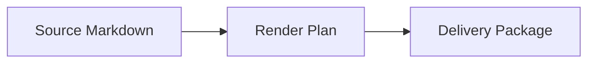

# Enterprise AI rollout proposal

## Executive summary

This fixture exercises the DOCX Engine V2 delivery path with Markdown text, tables, editable generated figures, and copied source images.

## Architecture

| Component | Role |
| --- | --- |
| Source package | Normalizes Markdown into structured sections |
| Render plan | Binds tables and images to template data |
| Delivery package | Keeps the generated DOCX and editable assets together |

## Acceptance

- The generated document must be a readable DOCX zip.
- The delivery package must include source, assets, manifest files, render plan, quality report, and image editing instructions.
