# 专家团功能第一性原理与对抗性复盘方案

> 审计日期：2026-07-10
>
> 审计范围：专家中心、召唤弹窗、需求确认、专家团工作台、五阶段执行、阶段复核、协作视图、成果视图、前端状态管理、后端状态机、聊天流、产物契约、测试与发布门禁
>
> 实机环境：macOS Electron 桌面端，1272 × 768 可见窗口；内容创作专家团；真实完成 5/5 全流程
>
> 结论等级：**不通过，存在 1 个实机复现 P0、2 个代码证据支持的 P0 级风险、12 个 P1；不建议在修复 P0 前把当前流程作为正式可用的稳定主路径。**

> 实施闭环更新：**2026-07-10 已完成修复并通过独立对抗复审。上述结论保留为修复前的审计基线；当前代码合入判定为 GO。生产级文档交付仍以真实 WPS/Word 打开、编辑、保存、重开为最终门禁，本轮因 macOS 屏幕锁定未能完成，不写为通过。**

---

## -1. 实施闭环更新（当前有效结论）

### -1.1 第一性原理下的最终产品决策

用户在完成最后一项需求确认时，已经同时表达了“按已确认需求开始执行”的明确意图。所以正常主路径只能有一个业务动作：

```text
填写最后一项需求
  → 服务端原子保存答案并预留唯一启动
  → 真实创建当前阶段执行
  → 返回权威 generating/stream
  → 前端自动关闭需求确认页
  → 工作台直接显示真实运行状态
```

正常流程不再出现“关闭确认页→再点继续/开始”。只有真实启动失败时，才显示可发现的“重新尝试”恢复动作。

### -1.2 已落地的修复

| 层级 | 修复后的不变量 | 落地结果 |
|---|---|---|
| 前端交互 | 同一时刻只有一个主操作 | 最后答案成功后自动关闭确认页；不再暴露二次“继续”；启动失败才显示重试 |
| 前端状态 | 服务端 run 是唯一权威 | 轮询只在同 session/run/stage/question 时恢复值、焦点、选区和滚动；问题已推进时，旧输入变为可复制草稿，不覆盖新状态 |
| 启动事务 | 一个授权只有一个执行副作用 | 最后答案与 durable `starting` reservation 同次写入；`reserved → dispatching → started`；幂等键、CAS、有界租约恢复防止重复 stream |
| 迟到回调 | 同一 reservation/runtime 不能被自己取消 | 对账已绑定的同一 runtime 按幂等成功处理，不重复增加 attempt；只取消败给新 identity 的旧 runtime |
| 结果归属 | 结果必须绑定 run/stage/attempt/stream | 不再以 session 最后一条 assistant 消息猜测阶段结果；执行事件与阶段输出可对账 |
| 富稿交付 | 规范源稿和派生包不得混同 | canonical `draft.md` 保留原始内容；Mermaid 图片引用只进入派生 package；每次从规范源在空临时目录重建、校验、再原子发布，预存/篡改包不能自证 |
| 文档交付 | 完成态必须可验证 | DOCX、source、render plan、assets、quality report、Office 证据和完成摘要相互绑定；漂移、跨工作区、符号链接和大小写别名 fail-closed |
| Office 复核 | “通过”必须有本次真实复核会话 | 专家团使用 `locked → ready → consumed` 一次性 token，绑定 session/run/stage/attempt/document SHA；证据先持久化再消费 token；通用 DOCX 工作台使用独立本地人工验收协议 |

### -1.3 对抗审查关闭的关键场景

- 并发点击、网络重试和跨进程 CAS 只能产生一个启动者。
- 远端已创建但本地回调延迟时，过期对账能认领同一运行；原始回调稍后返回不会再把它取消。
- 人工重试已产生新 reservation/runtime 时，迟到的旧 runtime 仍会被正确取消。
- 只篡改 package `draft.md`，或同时伪造 manifest 的输入摘要，都不能让旧包成为当前稿件。
- 富稿重建失败、第二次 rename 失败或发布后校验失败时，旧有效包恢复，不遗留 backup/failed 目录。
- Office token 过期后清空检查项、证据和声明，保留备注只读；proof 写入失败时 token 不被误消费。

### -1.4 当前验证证据

| 验证项 | 实时结果 | 结论边界 |
|---|---:|---|
| 相关 WebUI/Python fresh gate | `475 passed, 1 deselected` | 唯一 deselected 为仓库既有 Service Worker 品牌名断言；单独运行仍期待 `hermes-shell`，当前源码是 `taiji-shell` |
| WebUI 全仓广泛基线（本轮较早执行） | `7671 passed, 72 skipped, 130 failed` | 失败集中于本任务外的历史/环境基线，未发现专家团或本轮交付链失败；未在最后代码上重跑全仓，不写为全仓全绿 |
| 启动/恢复/跨进程并发 | `95 passed` | 含同 runtime 幂等回调与不同 runtime 取消 |
| 富稿与完整性定向 | `38 passed` | 含两种篡改、失败恢复、并发重建 |
| 独立后端对抗复审 | `107 passed`，GO | 未发现新的 P0/P1 |
| DOCX 引擎全量 | `217 passed` | Node 完整套件 |
| 真实 DOCX 生成 | `4 passed` | 内容创作、研究、会议纪要、含图文档；ZIP/结构与 PDF 可渲染，不等于 WPS/Word 终验 |
| 前端合同 | `153 passed` | 包含权威状态、恢复草稿、Office 三态、通用模式和 390px 触控目标 |
| 静态门禁 | 通过 | Ruff、`compileall`、ESLint runtime guard、`node --check`、`git diff --check` |
| 真实 WPS/Word 打开终验 | **未验证** | 实时系统状态为 `CGSSessionScreenIsLocked=Yes`；不用自动报告、LibreOffice 或截图代替人工终验 |

前端 Office 状态证据：[locked](./evidence/19-expert-office-locked-desktop.png)、[ready](./evidence/20-expert-office-ready-desktop.png)、[consumed](./evidence/21-expert-office-consumed-desktop.png)、[通用模式 390px](./evidence/22-generic-office-ready-mobile-390.png)。这些图只证明页面状态和可用性合同，不证明 WPS/Word 已实际完成复核。

`13–16` 为 Office 验收页的中间实施截图；`17–18` 是对抗检查发现 token 消费后可编辑/失效恢复问题时的 **RED 证据**，不代表最终界面；`19–22` 才是修复后用于最终 UX QA 的状态截图。

### -1.5 当前发布判定与剩余风险

- **代码合入：GO。** 核心 P0、后续对抗发现的 P1 均已有 RED→GREEN 证据和独立复审。
- **完整生产交付：条件性 NO-GO。** 唯一高优先级未闭环是真实 WPS/Word 打开、逐页检查、编辑、保存和重开。
- Service Worker 的 `hermes-shell`/`taiji-shell` 断言是已确认的旧基线测试问题，不影响本次专家团主路径，但应在品牌清理专项中统一修正。
- 富稿目录发布使用“候选校验→旧包备份→发布→失败恢复”。普通异常和并发已验证；在两次 rename 之间强制断电的极窄窗口，下次构建可从 canonical source fail-closed 重建正式包，但中断遗留的 backup 自动清理尚未做专门故障注入，列为 P2 工程韧性项。

## 0. 结论先行

这次复盘最重要的结论不是“页面还可以再美化”，而是：

> 当前专家团并不是一个由单一状态机驱动的可靠委托系统，而是前端工作台、专家团 run JSON、聊天 stream、session 消息、Gateway 审批、旧 writeflow、rich draft 和 DOCX 引擎共同拼接出来的多事实源系统。它能在理想条件下跑完，但用户看到的状态、后端真实状态、正在执行的 stream 和最终产物并不总是同一件事。

用户补充的核心问题已经在真实 Electron 中完整复现，而且比描述更严重：

1. 需求确认完成后，页面提示“需求已确认，正在进入生成”“后台正在按当前阶段生成内容”，真实状态却仍是 `ready_to_generate / 待启动`。
2. 用户必须先关闭需求确认页，才能看到底层的“开始生成”按钮，再点一次才真正创建聊天 stream。
3. 这个隐藏二次启动不是只发生一次；阶段 1→2、3→4、4→5 均重复出现。
4. 根因已定位到后端条件永远不成立：`answer` 和 `stage/approve` 只在 `run.status == "running"` 时自动启动，但 `ready_to_generate` 在 `_sync_derived()` 中被映射为 `status="awaiting_user"`、`execution_status="idle"`。因此接口虽然写了“自动开始”的分支，实际永远不会进入。
5. 前端随后又把 `ready_to_generate` 和 `generating` 共用同一句“后台正在按当前阶段生成内容”，再配上“正在进入生成”的成功 toast，形成了明确的假进度。

这是 P0，不是一般易用性问题。它同时破坏了三个最基本的产品承诺：

- 用户完成明确动作后，系统应按承诺推进；
- 状态文案必须反映真实系统状态；
- 一个阶段推进只能有一个明确主操作。

推荐的产品决策只有一个：

> “完成确认”“无修改，进入下一阶段”本身就是启动授权。后端必须在同一请求中完成“状态推进 + 创建下一阶段 stream”，前端不得再让用户寻找第二个按钮。`开始生成` 只保留为异常恢复动作，不作为正常流程的一部分。

---

## 1. 证据等级与边界

本报告严格区分证据，不把代码存在、测试字符串命中或状态条完成当作真实可用。

| 证据等级 | 本次覆盖 | 可以证明 | 不能证明 |
|---|---|---|---|
| 已实时验证 | 真实 Electron 完成需求确认与 5/5 全阶段；检查待办、协作、成果、完整预览；实测按钮与轮询后状态 | 当前 macOS 桌面端真实用户路径、可见性、交互结果、重复启动问题、最终成果入口现状 | Kylin/UOS/Windows、断网重连、进程重启、屏幕阅读器 |
| 当前代码证据 | 阅读前端 presenter/actions/ui、后端 view/runtime/routes/storage、Gateway、rich draft 与 DOCX 契约 | 状态映射、错误条件、数据归属、竞态窗口、产物契约不一致的根因 | 所有生产环境部署都与当前工作区完全一致 |
| 当前自动化 | 相关专家团测试 57/57；runtime lint；桌面 main.js check；Electron fixture smoke；Linux 静态打包 60/60 | 一部分静态合同和语法检查通过；fixture smoke 成功生成 1024/1280/1440 三档截图 | 真实模型流、真实阶段推进、真实文件打开、辅助技术；fixture smoke 没有基线像素比较或逐视口视觉断言，不能替代实机流程或视觉回归 |
| 当前失败证据 | 旧 writeflow 38 通过、15 失败；项目默认环境直接跑 Electron smoke 缺 Playwright；Python artifact smoke 缺 Playwright | 兼容层与测试环境没有收口，发布门禁存在盲区 | 不能把所有 15 个失败都直接等同为当前专家团主路径 bug |
| 历史约束 | 既有 Plan A 与用户反馈：需求确认是前置准备；右侧工作台承载操作；最终关键内容留在聊天；完成状态不等于 DOCX 交付 | 产品边界与验收标准 | 仍需用当前实机重新核验，历史不代替实时证据 |

明确未验证：

- 进程重启后 pending 审批、当前阶段、未提交文本和 stream 是否完整恢复；
- 两个窗口/两个快速点击并发操作同一 run 时的最终状态；
- 网络抖动、超时、5xx、鉴权失效下的恢复体验；
- 深度材料研究团的真实 Electron 端到端流程；本轮只完成内容创作专家团实机全流程，研究团仅有 fixture 覆盖；
- VoiceOver、完整键盘路径和自动化无障碍扫描；
- Kylin/UOS/Windows 不同缩放比例下的真实视觉与交互；
- 最终 DOCX 的 WPS/Word 打开验收——本次 5/5 完成后没有出现可打开的 DOCX 文件入口。

---

## 2. 第一性原理：专家团到底应该解决什么

### 2.1 用户的真实任务

用户不是来“操作一个多 Agent 状态机”的。用户的工作只有四件事：

1. 说明目标与边界；
2. 把任务委托出去；
3. 在必要节点做判断；
4. 拿到可验证、可继续使用的结果。

因此，任何要求用户理解 `ready_to_generate`、关闭覆盖层、寻找底层按钮、判断 stream 是否真的创建、区分聊天结果与文件产物的设计，都把系统内部复杂性泄漏给了用户。

### 2.2 四条不可破坏的产品不变量

| 不变量 | 正确含义 | 当前表现 |
|---|---|---|
| 意图只确认一次 | 同一阶段同一授权不要求重复点击 | **失败**：确认/复核后还要再点开始 |
| 状态只能说真话 | “正在生成”必须已有绑定到当前 run/stage 的活动 stream | **失败**：待启动状态显示后台正在生成 |
| 操作必须作用于确定对象 | 每次 mutation 要绑定 run、stage、version、input/approval、stream | **失败**：多个接口主要只带 `run_id` |
| 完成必须有可验证交付 | 完成不仅是状态，还要有结果归属、文件存在、打开入口和质量证据 | **失败**：5/5 后只有聊天文本/预览，无文件入口 |

### 2.3 目标体验原则

- 一屏只回答三件事：现在是什么状态、谁在做、用户下一步是什么。
- 正常流程每个时刻最多一个主按钮。
- “下一阶段”是一次业务授权，不是两次技术启动。
- 需求确认是阶段 0，不计入 1/5 执行进度；这一点当前做对了，应保留。
- 后端是状态真相，前端不得根据乐观文案猜测“已经开始”。
- 聊天区保留关键结论，右栏承载状态与操作，成果区承载可验证产物；三者职责不能互相替代。
- 错误恢复动作必须显式命名为“重试启动/恢复生成”，不能伪装成正常的“继续”。

---

## 3. 真实桌面端用户旅程复盘

健康度定义：`健康` = 主任务清晰且行为与状态一致；`有风险` = 可完成但有明显理解或恢复成本；`损坏` = 主路径阻断、误导或结果不可信。

| 步骤 | 用户动作与预期 | 实机结果 | 健康度 | 主要问题 |
|---:|---|---|---|---|
| 1 | 从一级导航进入专家团，快速判断有哪些团队 | 能看到两个团队和能力简介 | 有风险 | 卡片缺少明确 CTA；左侧说明栏占宽但信息弱；内容区大量空白；搜索价值有限 |
| 2 | 打开团队详情，判断能力、成员、示例并召唤 | 详情完整，示例可直接带入需求 | 有风险 | 弹窗信息密、双列滚动、关闭按钮小；“召唤”前没有简短任务预览/成本说明 |
| 3 | 召唤后确认专家团已创建、下一步在哪里 | 聊天告知已创建，右栏给“去确认” | 健康 | 状态与入口基本一致；需求确认放在右侧而非聊天操作卡，方向正确 |
| 4 | 依次填写 3 个必填问题，可回看与修改 | 上一题/下一题可用，已填答案保留 | 健康 | 输入流程本身可用；需求确认属于 0/5，进度表达正确 |
| 5 | 处理 1 个可选问题并开始生成 | 点击“跳过并开始生成”后显示完成页和成功 toast | **损坏** | 完成页只显示可选题 1/1，丢失 3 个必填答案摘要；页面声称将继续推进但未启动 |
| 6 | 确认后系统立即执行 | 必须关闭确认页，底层才出现“开始生成”；再次点击才真正运行 | **损坏 / P0** | 隐藏二次启动；覆盖层遮住唯一恢复入口；假进度 |
| 7 | 阶段生成中知道谁在做、能停止、能看到输出 | 聊天流与右栏生成状态可见，阶段结束进入复核 | 有风险 | 长输出高度过大；停止无确认；中断与取消的后果不清；错误恢复未实机验证 |
| 8 | 复核后一次进入下一阶段 | “无修改，进入下一阶段”后再次停在待启动 | **损坏 / P0** | 同一问题在阶段间反复出现；正常五阶段变成至少九次授权 |
| 9 | 查看团队成员、当前负责人和进度 | 5 位成员、头像、角色、当前/待命状态正确显示 | 健康 | 这是当前设计中最接近目标模型的一部分；仍需补键盘 tab 语义与小屏验证 |
| 10 | 处理审稿发现并汇入修改意见 | “加入修改意见”提示无输入区；“标记已阅”5 秒轮询后回退 | **损坏 / P1** | 一个按钮是断链，一个按钮是假持久化；破坏用户对复核记录的信任 |
| 11 | 在成果页看阶段结果和完整预览 | 可看摘要和完整 Markdown 预览 | 有风险 | 成果页原始 Markdown 密度高、大片空白；预览 Esc 不关闭，关闭后焦点不返回触发点 |
| 12 | 5/5 完成后拿到最终可继续使用的成果 | 聊天保留最终文本，成果页可看完整文本 | **损坏 / P1** | 没有 DOCX/PDF/Markdown 文件入口；没有打开/下载；“交付确认”实际只确认聊天文本 |

### 3.1 入口与团队详情

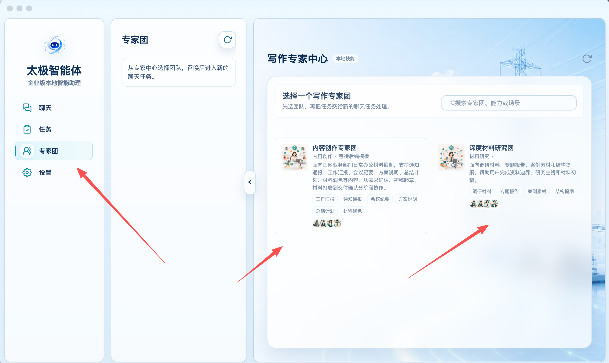

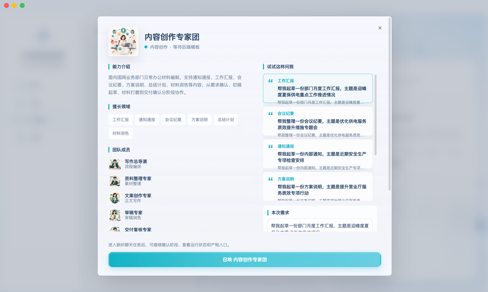

正向点：团队能力、领域、成员和示例问法集中展示，用户能理解“召唤一个预配置团队”而非自己逐个选 Agent。

问题：信息架构仍偏展示页，不像任务入口。卡片本身是否可点不够显性；中间说明列与主内容列的空间分配失衡；只有两个团队时搜索与大面积留白放大了“内容没做完”的感受。

### 3.2 需求确认

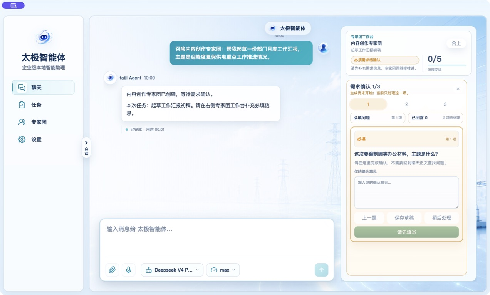

正向点：

- 需求确认放在右侧工作台；
- 必填/可选、题号、上一题和草稿入口清晰；
- 键盘焦点与 Esc 关闭在这一层已有实现；
- 填过的题目可以返回，答案未丢失。

关键断点：完成页把“确认完成”错误等同于“执行已经开始”。前端显示“专家团将继续推进”，后端仍停在 `ready_to_generate`。

### 3.3 隐藏二次启动

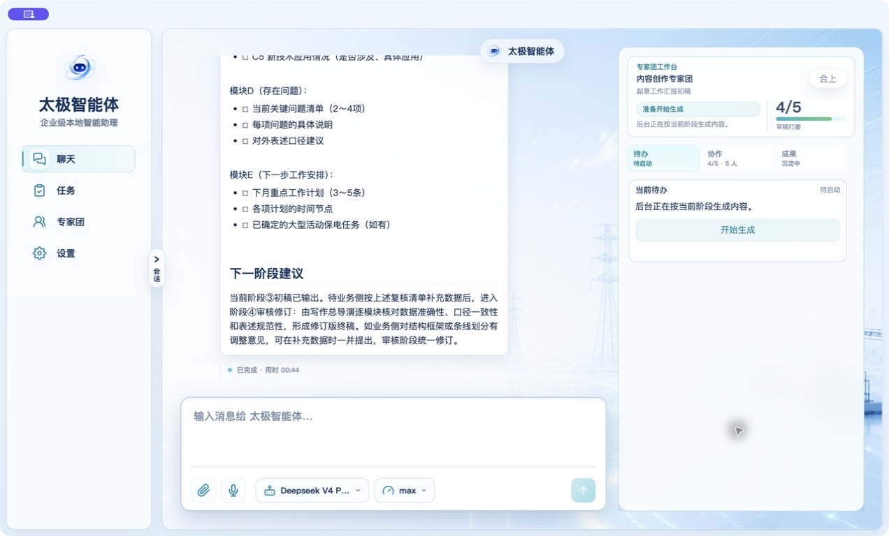

图中同时存在互相冲突的三个信号：

- 顶部：“准备开始生成”；
- 说明：“后台正在按当前阶段生成内容”；
- 待办：“待启动 / 开始生成”。

对普通用户而言，这不是“稍微绕”，而是无法判断系统到底有没有工作。用户如果相信顶部状态，就会等待一个永远不会开始的任务；如果不主动关闭覆盖层或切换区域，也看不到真正的启动按钮。

### 3.4 协作视图

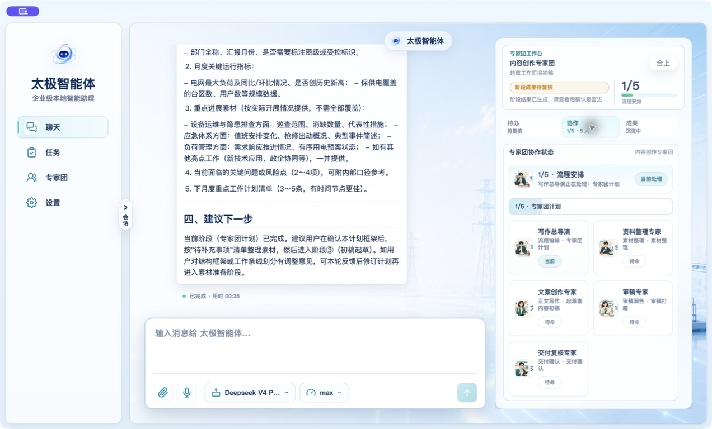

正向点：成员来自当前专家团真实数据；5 人数量、头像、角色、当前成员和任务状态一致。它回答了“谁在做什么”。

需要保留的设计决策：协作视图不应再拆回重复的“流程/成员”两个 tab；成员与流程要围绕当前阶段合并表达。

### 3.5 成果与完整预览

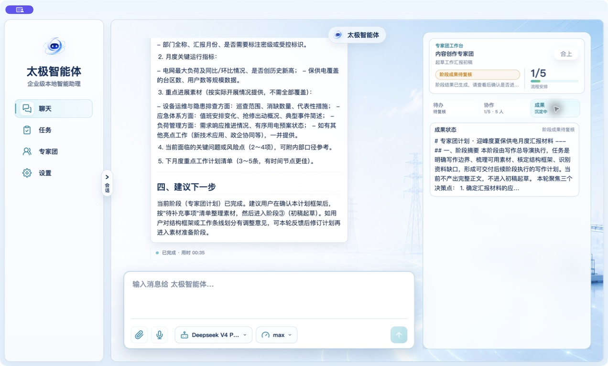

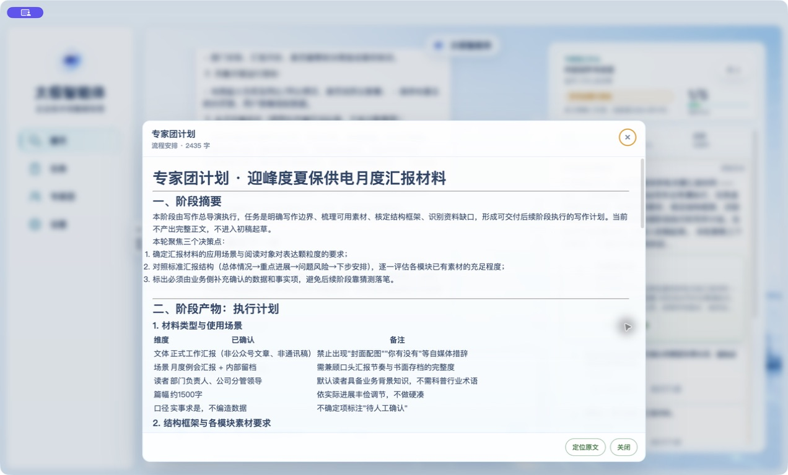

完整预览比成果 tab 本身可读，但仍只是从聊天结果复制出的 Markdown。成果 tab 没有把“阶段文本、文件产物、最终交付、历史阶段”分层，最终形成“有内容但不可交付”的状态。

### 3.6 5/5 终态

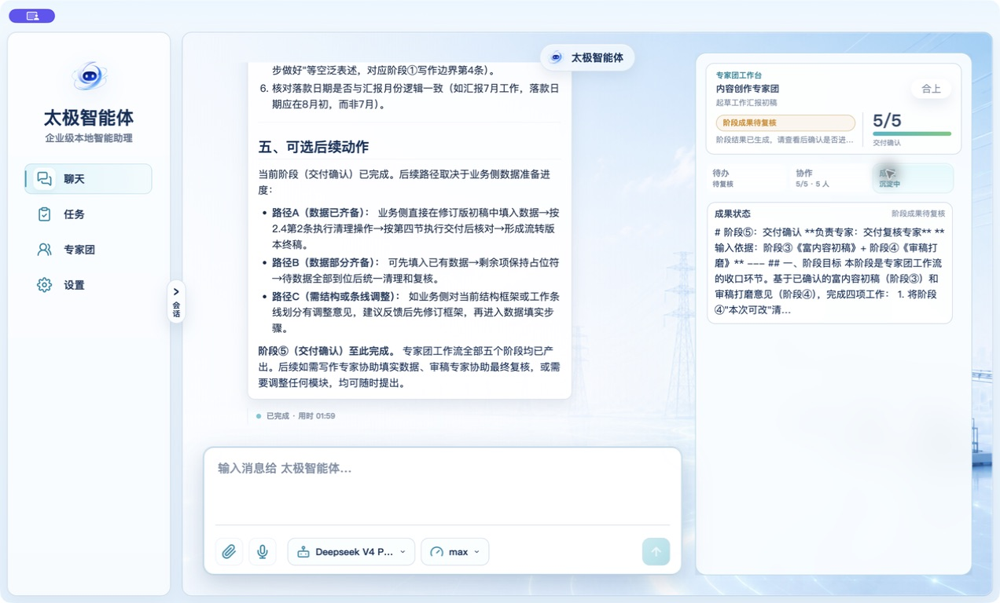

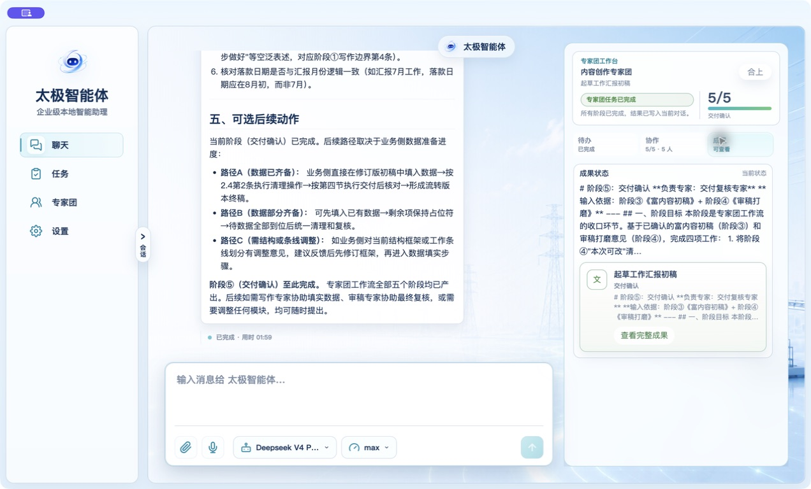

最终确认后系统显示“所有阶段已完成，结果已写入当前对话”。这句话本身诚实，但与“交付确认”“成果可查看”共同出现时，会让用户误以为已形成正式交付物。当前没有文件存在性、模板渲染、打开按钮或 WPS/Word 证据。

---

## 4. P0 与 P0 级风险根因分析

### P0-01：需求确认与阶段复核后的隐藏二次启动

**用户影响**

- 主流程静默停止；
- 页面显示正在生成但系统没有活动 stream；
- 每个阶段都增加一次隐藏操作；
- 用户可能等待、重复点击或误以为模型卡死。

**代码根因**

1. `runtime.py:338-353`：所有问题完成后只进入 `ready_to_generate`。
2. `runtime.py:205-225`：`ready_to_generate` 被映射为 `status="awaiting_user"`、`execution_status="idle"`。
3. `routes.py:10553-10562`：`/answer` 仅在 `run.status == "running"` 时调用 `_start_expert_team_execution()`；条件不可能成立。
4. `routes.py:10579-10585`：`/stage/approve` 使用同样的错误条件，因此阶段间也不会自动启动。
5. `view.py:118-121`：`ready_to_generate`、`generating`、`revising` 共用“后台正在按当前阶段生成内容”。
6. `ui.js:2708-2711`：只要问题都结束，就 toast“需求已确认，正在进入生成”，不检查 `stream_id` 或真实 `generating` 状态。

**影响面**

- 内容创作专家团与深度材料研究团；
- 需求确认完成；
- 每次阶段批准；
- 任何依赖 `ready_to_generate` 的恢复流程；
- 轮询与会话重进时的状态解释。

**修复原则**

- 正常路径：`answer/approve -> validate -> start stream -> mark generating -> response` 为一个业务动作；
- 如果 stream 创建失败，接口返回失败或 `start_failed` 可恢复状态，不得返回成功 + 假进度；
- `ready_to_generate` 只作为极短暂内部态或异常恢复态；
- 正常 UI 不展示第二个“开始生成”。

### P0-R02：Mutation 没有 run 版本与阶段身份，旧操作可能作用到新阶段

> 证据等级：代码审查与隔离探针支持的 P0 级风险；本轮未做双窗口/真实并发 Electron 复现。

**代码证据**

- `runtime.py:347-508` 的 answer、input、approve、revise、resume 主要根据 `run_id` 读取最新 run 后直接变更；
- `routes.py:10569-10661` 请求体没有强制 `expected_version`、`stage_id`、`input_id`、`stream_id`、`idempotency_key`；
- `submit_expert_team_stage_input()` 会读取当前 `pending_input`，但调用方没有提交/校验用户看到的 input id；
- `approve_expert_team_stage()` 总是批准“当前”阶段，而不是用户点击时看到的那个阶段。

**对抗场景**

1. 用户开两个窗口；窗口 A 停在阶段 2，窗口 B 已进入阶段 3；A 再点“无修改”可能推进阶段 3。
2. 5 秒轮询重绘后，旧按钮的异步响应晚到，覆盖新阶段工作台。
3. 快速双击或网络重试可能重复推进、重复创建 stream。

**修复原则**

所有控制操作至少提交并校验：

```json
{
  "run_id": "et-...",
  "expected_version": 7,
  "stage_id": "draft",
  "action_id": "approve:draft:7",
  "idempotency_key": "uuid",
  "session_id": "..."
}
```

后端不匹配时返回 `409 stale_state` 和最新 view；不能“尽量执行”。

### P0-R03：阶段结果通过“执行开始后的最后一条 assistant 消息”推断，可能绑定错内容

> 证据等级：代码审查与隔离探针支持的 P0 级风险；本轮未在真实并发聊天中复现错误归属。

**代码根因**

- `routes.py:1300-1325` 在 session 所有 assistant 消息中按时间找最后一条；
- `routes.py:1371-1393` 当 stream 消失且 session 不 busy 时，把该消息当作当前专家团阶段交付；
- 消息没有强制 `expert_team_run_id + stage_id + stream_id` 归属；
- 异常被 `routes.py:1402-1403` 吞掉，可能长期保留看似运行中的旧状态。

**对抗场景**

- 专家团运行期间，另一个普通聊天回复晚到；
- 旧 stream 重连补发消息；
- 用户切会话或同一 session 发起另一个任务；
- 模型返回空结果，但随后出现 unrelated assistant 提示。

**后果**

错误文本可能被当作阶段成果、通过校验、进入下一阶段，最终让 5/5 的完成状态建立在错误内容之上。

**修复原则**

- stream 完成事件必须带 `run_id/stage_id/stream_id/output_id`；
- 只有匹配当前 run 期望 stream 的 final event 才能完成阶段；
- session 消息只用于展示，不再作为专家团状态机的事实来源；
- 超时/找不到绑定结果时明确失败，不做时间猜测。

---

## 5. 完整问题清单

### 5.1 P1：严重问题

| 编号 | 问题 | 证据与根因 | 影响 |
|---|---|---|---|
| P1-01 | 修改意见可能完全不进入下一次生成 | `runtime.py:499-503` 写入顶层 `revision_feedback[]`；`routes.py:1075-1087` 只读 `current.feedback` 或 output 的 `feedback_history` | 用户认真填写的修改意见被忽略，重新生成看似成功但未按意见改 |
| P1-02 | rich draft 契约与 DOCX 引擎不兼容 | `rich_draft.py:100-134` 生成 `version:1 + assets`；DOCX `package-rich-draft.js:130-149` 需要 `schemaVersion: rich-draft-package/v2 + files/blocks/figures/tables` | 富内容初稿无法稳定进入模板渲染链 |
| P1-03 | 产物在后续阶段被覆盖/不可发现 | `runtime.py:458-469` 每阶段先把 `artifacts` 改成聊天产物，再追加当前 rich draft；新 UI presenter 只渲染 result，不渲染 artifacts/referenceArtifacts | 阶段 3 的富内容包在阶段 4/5 后不可见；用户无法打开、下载或追溯 |
| P1-04 | 复核项按钮是断链/假状态 | 实机：“加入修改意见”提示当前无输入；“标记已阅”轮询后恢复；`ui.js:2862-2896` 一个寻找旧 dock DOM，一个只改 DOM 不持久化 | 用户对审稿记录失去信任，复核结论不可追踪 |
| P1-05 | GET run 任意错误可能被当作“没有 run” | `sessions.js:1012-1043` 的错误路径会清工作台/停止轮询 | 短暂 500/鉴权/网络错误导致当前任务像消失 |
| P1-06 | 5 秒轮询整块重绘，阶段输入有被清空风险 | `expert-team-ui.js:94-112` 有 textarea；`ui.js`/`sessions.js` 轮询重渲染；保护逻辑未覆盖新 stage input | 用户填写长说明时可能丢字 |
| P1-07 | 新 action 缺少统一 single-flight 与错误恢复 | `expert-team-actions.js:54-110` 多数动作无禁用、无 `aria-busy`、无 try/catch；与 `ui.js:2899+` 的旧稳定实现并存 | 双击、慢网和失败重试可能重复请求，错误反馈不一致 |
| P1-08 | run JSON 非原子写、无锁、无 CAS | `storage.py:25-38` 直接写文件；专家团与轮询/stream 回调可并发修改 | 文件截断、后写覆盖先写、状态回退 |
| P1-09 | 审批身份与持久化不足 | Gateway 同一 run 的多个审批可被一次响应一起清；pending 主要在内存；run/approval 对齐不完整 | 重启丢审批、批错审批、看见卡但无法恢复 |
| P1-10 | 专家团执行绕过统一 RuntimeAdapter/授权门禁 | `_start_expert_team_execution()` 直接调用 `_start_chat_stream_for_session()`；代码探针中授权阻断时专家团 start 仍返回 200 | 商业授权、安全策略和普通聊天执行口径不一致 |
| P1-11 | “停止生成”没有确认，也未解释影响 | `view.py:25-37` 暴露 danger action；前端直接 POST cancel；当前 run 变 terminal，stream cancel 与 run cancel 非事务 | 误触后任务中断；用户不清楚已产出内容和恢复方式 |
| P1-12 | 测试与发布门禁给出虚假安全感 | 专家团相关 57 通过，但真实隐藏启动仍存在；旧 writeflow 15 失败；默认环境 smoke 缺依赖；release check 只覆盖少量静态项 | “测试绿”不能证明主流程能跑；兼容回归可能带入版本 |

### 5.2 P2：中等问题

| 编号 | 问题 | 改进方向 |
|---|---|---|
| P2-01 | 需求完成页显示 1/1，只统计当前可选题，用户看不到 3 个必填答案 | 完成页显示“必填 3/3、可选 0/1 已跳过”，提供折叠回顾；开始后自动收为摘要 |
| P2-02 | “可选补充”却写“请先补充需求信息，专家团再继续” | 可选态改为“可补充，也可直接开始”；不能用阻断语气 |
| P2-03 | 成果 tab 把 raw Markdown、摘要和状态混成一块 | 分为“最终交付 / 当前阶段 / 历史阶段”，默认展示渲染后的结果与主文件 |
| P2-04 | 完整预览 `aria-modal=false`、Esc 不关闭、焦点不回触发点 | 按需求确认弹窗的成熟模式统一实现 dialog、focus trap、Esc、return focus |
| P2-05 | 工作台 tab 缺完整 tablist/tabpanel 键盘语义 | 增加 `role=tablist/tab/tabpanel`、`aria-controls`、方向键导航和 roving tabindex |
| P2-06 | 901–1320px 响应式规则与设计目标不一致 | 以 1024/1280/1440 三档实机截屏和键盘流做门禁，不只做 CSS 字符串断言 |
| P2-07 | `revising`、部分通知/错误仍可能暴露英文 | 后端对外 view 统一中文业务枚举；原始状态只进日志/诊断页 |
| P2-08 | `primary_confirmation` 的字段合同与旧前端读取不完全一致 | 明确 schema、做 typed contract test；淘汰双 presenter |
| P2-09 | 团队卡片缺可发现 CTA，详情弹窗信息密度过高 | 卡片加“查看详情/召唤”明确动作；详情首屏只保留定位、适用场景、3 个成员摘要、CTA |
| P2-10 | “成果沉淀中”在已有阶段结果时仍显示，语义含混 | 用“阶段结果可查看 / 最终交付未生成”两个独立状态 |

### 5.3 P3：优化项

- 统一按钮高度、触控面积、焦点环和 danger 色 token，避免同一工作台出现多套按钮视觉。
- 团队详情与工作台的图标、圆角、标题层级和间距应复用现有设计 token，减少“页面内套另一套产品”的感觉。
- 长阶段输出增加目录、折叠、回到顶部和“只看结论/待补充项”视图，降低长时间工作疲劳。

---

## 6. 后端与状态机复盘

### 6.1 当前事实源拓扑

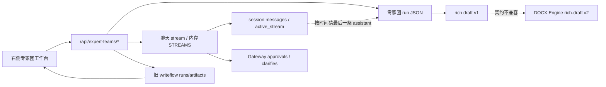

问题不在于“组件多”，而在于没有一个带版本的权威事件流把它们连接起来。状态被多个系统相互推断：

- 前端根据 view 文案推断执行；
- run 根据 session 的最后一条消息推断完成；
- session 根据 stream 内存推断 busy；
- 成果 UI在新 presenter 与旧 writeflow artifact renderer 之间分裂；
- Gateway pending 审批又有自己的内存真相。

### 6.2 当前状态机中的错误语义

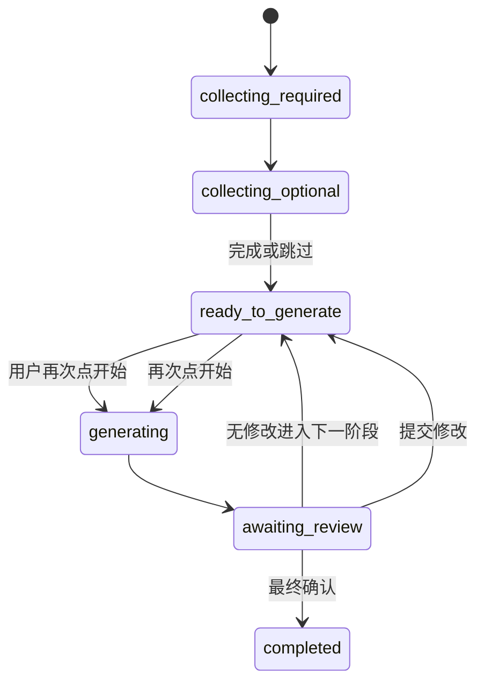

当前 `ready_to_generate` 同时承担三种含义：

1. 正常确认后等待后端启动；
2. 用户必须手动启动；
3. 失败/取消后的恢复入口。

这三种含义不能共用一个状态。

### 6.3 目标状态机

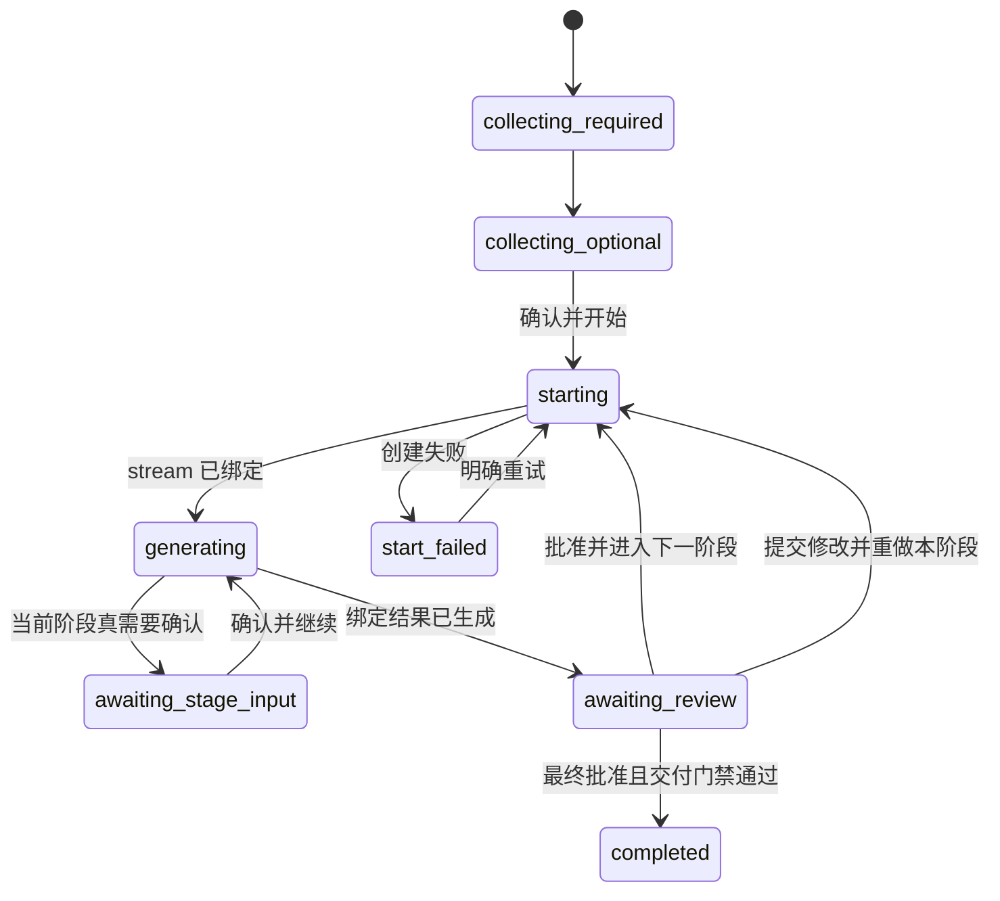

核心差异：

- 用户动作直接进入 `starting`，不是进入一个需要再点按钮的 `ready`；
- 只有 stream 绑定成功才进入 `generating`；
- `start_failed` 是显式、可恢复、说真话的状态；
- 阶段结果必须由绑定事件完成；
- 最终 `completed` 受交付门禁保护。

### 6.4 建议的最小权威模型

不建议另造一套平行 API；应在现有 `/api/expert-teams/*` 合同上补齐身份与版本，并复用现有 RuntimeAdapter。

```json
{
  "run_id": "et-...",
  "version": 8,
  "session_id": "...",
  "workflow_state": "generating",
  "stage": {
    "id": "draft",
    "attempt": 2,
    "status": "running"
  },
  "execution": {
    "stream_id": "...",
    "started_at": "...",
    "last_event_seq": 41
  },
  "pending": {
    "input_id": null,
    "approval_id": null
  },
  "outputs": [
    {
      "output_id": "...",
      "stage_id": "draft",
      "attempt": 2,
      "stream_id": "...",
      "status": "ready"
    }
  ]
}
```

复用现有运行时能力，而不是继续从 session 消息反推：

- `start_run(StartRunRequest)`
- `observe_run()` / `get_run()`
- `cancel_run()`
- `respond_approval(run_id, approval_id, choice)`
- `respond_clarify(run_id, clarify_id, response)`

---

## 7. 前端信息架构与交互改进方案

### 7.1 专家中心

目标：用户 10 秒内完成“选团—理解—召唤”。

- 移除或压缩中间空说明列，把说明放在主区标题下；
- 团队卡片提供两个显式动作：“查看详情”“召唤”；
- 卡片固定展示：一句定位、3–5 个场景标签、成员数量、阶段数量；
- 只有 2–5 个团队时不把搜索当首屏重点；团队更多时再启用搜索/筛选；
- 空间优先给团队差异，而不是背景图和空白。

### 7.2 团队详情/召唤

首屏只保留：

1. 团队定位；
2. 最适合做什么/不适合做什么；
3. 成员与阶段摘要；
4. 示例需求；
5. 主按钮“召唤并填写需求”。

能力长说明、完整成员职责、更多示例放折叠区。召唤前显示“将创建 5 阶段任务，需要在每阶段复核”的轻量预期，不显示内部 Agent 调度细节。

### 7.3 需求确认

推荐把最后一步主按钮改为：

- 必填最后一题还有可选项：`保存并查看可选补充`；
- 可选项有内容：`确认并开始生成`；
- 可选项为空：`跳过并开始生成`。

成功后的界面行为：

1. 按钮进入 `正在启动…`，防双击；
2. 接口只有在返回绑定 stream 后才显示“专家团正在生成”；
3. 确认窗口自动收起为一张只读摘要卡；
4. 摘要显示“必填 3/3，可选 0/1 已跳过”，支持“查看/修改需求”；
5. 启动失败时不关窗口，显示可读错误与“重试启动”。

### 7.4 阶段复核

主按钮语义与系统行为必须一致：

- `无修改，进入下一阶段`：提交批准并直接启动下一阶段；
- `提交修改并重新生成本阶段`：保存反馈并直接启动同阶段新 attempt；
- `暂不处理`：只收起，不改变 run；
- 不再出现正常流程的第二个“开始生成”。

复核项建议使用真正的选择模型：

- 每条有 `未处理 / 已阅 / 加入修改 / 忽略` 持久状态；
- “加入修改”直接写入同一阶段反馈草稿；
- 提交时后端保存 review item ids 与最终反馈；
- 轮询重绘后状态保持；
- 如果不准备持久化“已阅”，就删除该按钮，不制造假功能。

### 7.5 协作视图

保留当前“当前阶段 + 当前专家 + 全体成员”的结构。补充：

- 当前阶段预计输入/输出；
- 当前成员为什么在等待（若有）；
- 最近 3 条可信事件；
- 不展示内部英文状态或调度日志；
- 事件来自权威 run event，不从聊天文本猜测。

### 7.6 成果视图

成果区改为三层：

1. **最终交付**：主文件名、类型、更新时间、质量状态，主按钮“打开最终 DOCX”；
2. **当前阶段**：渲染后的阶段结果、查看原文、复核状态；
3. **历史阶段与参考材料**：折叠列表，可追溯但不抢主位。

如果某次任务定义只交付聊天文本，也要明确写“本任务未要求生成文件”，主按钮为“定位聊天结果/复制 Markdown”，不能用模糊的“交付确认”。

---

## 8. 分阶段实施计划

### Phase 0：冻结合同与建立可观测基线（1–2 天）

**目标**：在改 UI 前先让团队对“什么状态算真的开始/完成”达成唯一口径。

工作项：

- 写出专家团状态转换表、请求前置条件和错误码；
- 给 run 增加 `version`，事件增加 `event_id/seq/stage_id/attempt/stream_id`；
- 记录每次 mutation 的 `action_id/idempotency_key/expected_version/result`；
- 增加诊断日志：显示 run state、execution stream、session busy 三者是否一致；
- 把现有 15 个 writeflow 失败分类为“预期文案变更 / 真兼容回归 / 待删除旧合同”。

验收门槛：

- 任意 run 可以通过日志回答“谁、在何时、基于哪个版本、启动了哪个阶段的哪个 stream”；
- 新测试先能稳定复现隐藏二次启动；
- 不改视觉也可以确认状态事实唯一。

### Phase 1：修复 P0 主流程（2–4 天）

**目标**：一次确认，一次推进，状态说真话。

后端：

- 修正 `/answer` 与 `/stage/approve` 的不可能条件；
- 抽取统一 `_advance_and_start_expert_team_stage()`，在状态校验后创建 stream；
- stream 成功后才写 `generating`；失败写显式 `start_failed` 或返回失败并保留可恢复状态；
- 增加 idempotency，重复请求返回同一 stream/最新 run，不再重复创建；
- stage/input 与 stage/revise 也走同一启动器，消除四套分支差异。

前端：

- 最后确认和阶段批准按钮统一 loading/single-flight/error；
- 成功响应必须检查 `run.workflow_state === generating` 且有 stream identity；
- 需求确认成功后自动收起并展示完整答案摘要；
- `ready_to_generate` 文案改为“尚未开始”，只用于恢复态；
- 正常流程隐藏“开始生成”。

必须新增的真实测试：

1. 完成最后一个需求后，不关闭任何页面，聊天立即出现当前 run 的 thinking/stream；
2. 点击“无修改，进入下一阶段”后，不出现待启动按钮，下一阶段立即运行；
3. 同一个按钮双击只产生一个 stream；
4. stream 创建失败时不显示“正在生成”；
5. 刷新/重进会话后能恢复 generating 或 start_failed 的真实状态。

### Phase 2：统一状态身份与并发安全（3–5 天）

**目标**：旧按钮、旧窗口、旧响应不能修改新阶段。

- 所有 mutation 强制 `expected_version + stage_id + idempotency_key`；
- stage input 强制 `input_id`，审批强制 `approval_id`；
- run 写入改为临时文件 + fsync + replace，增加进程内锁或存储层 CAS；
- 异步响应只在 `run_id/version/stage_id` 仍匹配时更新 UI；
- GET 短暂失败保留旧工作台并显示“刷新失败”，不清空 run；
- pending approval/clarify 持久化，重启后可恢复；一次响应只清对应 id。

验收门槛：

- 双窗口陈旧批准返回 409，不推进新阶段；
- 连续点击、超时重试和轮询交错不产生重复阶段/stream；
- 杀进程后 run JSON 不损坏，pending 项可恢复。

### Phase 3：修复反馈与产物闭环（4–7 天）

**目标**：用户反馈真的被使用，阶段成果真的能进入最终交付。

- 统一 revision feedback 写入和 prompt 读取字段；
- review item 状态后端持久化，或删除不真实的“已阅”；
- rich draft 直接输出 `rich-draft-package/v2`，不要维护 v1 转换幻觉；
- artifacts 改为累积、按 stage/attempt 归档，不在每阶段覆盖；
- 新 presenter 正式渲染 artifacts/referenceArtifacts；
- delivery gate 要求主产物存在、可读、非空、类型匹配；
- 文档类任务把“打开最终 DOCX”设为成果区主按钮；
- 完成状态只有在交付门禁通过后才能写入。

验收门槛：

- 提交一条明确修改意见，下一 attempt 的 prompt 和结果可证明已采纳；
- 阶段 3 的 rich draft 到阶段 5 仍可打开；
- 最终文件路径真实存在，打开按钮成功；
- DOCX 在 WPS/Word 中完成封面、目录、正文和图片目视验收；
- 空内容或占位文件不能进入 completed。

### Phase 4：前端 UX、无障碍与长任务体验（3–5 天）

- 复用需求确认弹窗的 focus trap/Esc/return-focus 模式修完整成果预览；
- tablist/tabpanel 完整键盘语义；
- 1024/1280/1440 与系统缩放下做真实截图回归；
- 长结果提供目录、折叠、只看结论、待补充项筛选；
- 危险停止增加确认、说明影响和恢复路径；
- 统一中文状态与错误文案；
- 团队卡片与详情页压缩空白、明确 CTA。

验收门槛：

- 全程只用键盘可以召唤、确认、复核、查看成果并关闭弹窗；
- Esc 与焦点返回符合 dialog 规范；
- 1024 宽度无横向滚动、遮挡或主按钮不可达；
- 任何内部英文状态只出现在诊断日志。

### Phase 5：测试与发布门禁收口（持续，首轮 2–3 天）

建议测试金字塔：

| 层级 | 必测内容 | 发布要求 |
|---|---|---|
| 状态机单测 | 每个合法/非法 transition、version 冲突、idempotency | 全通过 |
| API 合同 | answer/approve/revise/input/cancel 的状态、stream 与错误码 | 全通过 |
| 集成测试 | 真实 stream final event 绑定 run/stage；重启恢复；产物累积 | 全通过 |
| Electron E2E | 需求确认→自动开始→5 阶段→最终文件打开 | 主路径全通过 |
| 视觉/无障碍 | 1024/1280/1440、焦点、Esc、tab、对比度 | 无 P0/P1 |
| 交付验收 | 最终 DOCX 存在并由 WPS/Word 打开 | 文档任务必须通过 |

发布门禁必须纳入：

- 当前专家团 57 项测试；
- writeflow 兼容测试归零或明确删除旧合同，不能长期带 15 个红灯；
- Electron smoke 的 Playwright 依赖进入项目可复现环境，不能依赖个人 Codex skill 目录；
- 真实模型主路径最少一条 nightly/发布候选验证；
- Linux 静态 60 项继续保留，但不得替代目标机实测。

---

## 9. 建议修改的代码边界

### 前端主改动

- `hermes-local-lab/sources/hermes-webui/static/expert-team-actions.js`
  - 统一 action single-flight、busy、try/catch、陈旧响应保护；
  - 去掉正常路径的二次 start。
- `hermes-local-lab/sources/hermes-webui/static/expert-team-ui.js`
  - 正确区分 starting/generating/start_failed；
  - 渲染完整确认摘要、真实 artifacts、持久化 review item 状态；
  - 修 tab 语义。
- `hermes-local-lab/sources/hermes-webui/static/ui.js`
  - 收口旧/新双 presenter；
  - 修完整成果 dialog；
  - 删除仅 DOM 的“已阅”和指向旧 dock 的加入修改逻辑。
- `hermes-local-lab/sources/hermes-webui/static/sessions.js`
  - GET 失败不清空；
  - 轮询保留当前输入与焦点；
  - 响应按 version/stage 合并。
- `hermes-local-lab/sources/hermes-webui/static/style.css`
  - 只在语义与行为修复后调整布局、响应式、焦点和密度。

### 后端主改动

- `api/expert_teams/runtime.py`
  - 状态机、版本、事件身份、feedback、artifacts 累积、完成门禁。
- `api/expert_teams/view.py`
  - 状态真实文案、恢复态、成果与 artifact contract。
- `api/routes.py`
  - 统一 advance/start；绑定 stream final event；不再按最后一条 assistant 猜结果；接入 RuntimeAdapter 与授权门禁。
- `api/expert_teams/storage.py`
  - 原子写、锁/CAS、schema migration。
- `api/expert_teams/rich_draft.py`
  - 输出 v2 contract 或调用 canonical packager。
- `api/gateway_chat.py`
  - approval/clarify 精确 id 与持久化恢复。

### 不建议的做法

- 只把“开始生成”按钮换个位置；
- 只把文案从“正在生成”改成“待启动”，但仍保留重复点击；
- 在前端收到 answer 成功后再偷偷发第二个 resume 请求；这会扩大竞态与重复 stream；
- 继续让 session 最后一条 assistant 消息决定阶段完成；
- 为 v1 rich draft 再写一层临时兼容而不收口 canonical v2；
- 用更多字符串断言测试代替真实 Electron 主路径。

---

## 10. 《前端 UX QA 报告》

### 10.1 QA 结论

**结论：不通过。**

- P0：1 个实机复现
- P0 级风险：2 个，已有代码与隔离探针证据，真实并发 Electron 场景未验证
- P1：12
- P2：10
- P3：3 组
- 主流程可见入口：有
- 主流程真实可完成：可通过隐藏操作完成，但不满足可发现性与状态真实性，因此不能判通过
- 代码中有能力但无可见/可访问入口：阶段 rich draft/文件 artifacts 在当前新成果视图不可见，按规则至少 P1

### 10.2 功能完整性

| 检查项 | 结果 | 说明 |
|---|---|---|
| 召唤专家团 | 通过 | 实机可用 |
| 必填需求填写 | 通过 | 3 题完成、可回退 |
| 可选需求跳过 | 通过但误导 | 接口完成，未自动执行 |
| 确认后自动生成 | **失败 P0** | 必须关闭并再次启动 |
| 阶段复核推进 | **失败 P0** | 每阶段重复待启动 |
| 协作成员展示 | 通过 | 5 人动态数据正确 |
| 修改意见 | **失败 P1** | UI断链；后端字段读写不一致 |
| 标记已阅 | **失败 P1** | 只改 DOM，轮询回退 |
| 成果预览 | 部分通过 | 文本可看，键盘与焦点不完整 |
| 产物打开/下载 | **失败 P1** | 当前 UI 无文件入口 |
| 最终交付 | **失败 P1** | 5/5 仅聊天文本，未验证 DOCX |

### 10.3 可见性、可发现性与信息架构

- 需求确认入口可见；
- 真正的开始按钮被完成覆盖层遮住，主流程不可发现，P0；
- 成果 tab 存在，但文件产物能力不可见，P1；
- 团队卡片可点性弱，P2；
- “沉淀中/可查看/交付确认”没有区分阶段文本和最终文件，P2。

### 10.4 交互与反馈

- 需求输入本地状态基本保留；
- 成功 toast 与真实状态冲突，P0；
- 新 actions 缺统一 loading/single-flight/error，P1；
- stop 无确认，P1；
- review item 的反馈是假状态，P1；
- 长生成期间有 thinking 和停止入口，这是正向项。

### 10.5 可访问性

已实时验证：

- 需求确认弹窗支持 Esc，代码有焦点陷阱；
- 完整成果预览打开后关闭按钮获得焦点；
- 完整成果预览按 Esc 不关闭；
- 关闭后焦点回到 HTML 根而非触发按钮。

代码检查：

- 成果预览使用 `role="dialog"` 但 `aria-modal="false"`；
- 工作台 tab 有 `aria-selected`，缺完整 tablist/tabpanel/方向键合同；
- 部分按钮尺寸与焦点样式不统一。

未验证：VoiceOver、自动 axe 扫描、所有键盘路径、对比度自动检测。不得写为通过。

### 10.6 响应式与视觉

已验证：Electron fixture smoke 成功生成 1024/1280/1440 三档截图；真实内容创作专家团流程在 1272×768 完成。fixture 没有基线像素比较或逐视口视觉断言，因此自动视觉回归仍为未验证。

风险：

- 右栏长复核项产生内部滚动，主操作在首屏下方；
- 聊天长输出与右栏并排导致阅读密度极高；
- 成果页信息少但空白大；
- CSS 响应式合同与设计文档边界不完全一致。

未验证：Kylin/UOS 缩放、Windows DPI、多显示器、系统字体替换。

### 10.7 自动化与回归

本次实时结果：

- `pytest` 专家团前端/API/rich draft/chat routing：57 passed；
- `npm run lint:runtime`：通过；
- `apps/taiji-desktop npm run check`：通过；
- Electron fixture smoke：通过；
- Linux packaging static：60 passed；
- writeflow API/frontend：38 passed，15 failed；
- Python artifact click smoke：未运行，当前 venv 缺 Playwright；
- 默认项目 Node 环境直接运行 Electron smoke：首次失败，缺 Playwright；指定外部 skill 的 Playwright 后通过，说明测试环境不可复现。

关键结论：当前自动化主要证明“某些字符串、fixture DOM 和语法存在”，没有覆盖“最后一题提交后必须真的生成”这一核心业务断言。

---

## 11. 验收清单：什么时候才可以说专家团真的修好

以下 18 项全部满足，才能把主路径标记为完成：

1. 最后一项需求确认只点击一次即出现绑定到当前 run/stage 的活动 stream；
2. 确认窗口自动收起，不遮挡恢复信息；
3. 前端只有 stream 成功后才显示“正在生成”；
4. 阶段批准一次即自动进入下一阶段；
5. 正常流程不出现第二个“开始生成”；
6. 双击/重试只创建一个 stream；
7. 旧窗口操作返回 409，不影响新阶段；
8. 短暂 GET 失败不清空工作台；
9. 轮询不清空未提交文本、不抢焦点、不跳滚动；
10. 修改意见在下一 attempt 的 prompt 和结果中可追溯；
11. review item 状态刷新后保持；
12. stream final event 通过 run/stage/stream 绑定完成阶段；
13. 阶段 3 的 rich draft 在阶段 5 后仍可访问；
14. 成果区展示主产物并可打开/下载；
15. 文档任务最终 DOCX 存在且 WPS/Word 实机打开通过；
16. Esc、焦点返回、tab 键与方向键满足无障碍路径；
17. 1024/1280/1440 真实截图无阻断问题；
18. 专家团、writeflow、Electron E2E 与发布门禁全部绿，且测试依赖可在项目内复现。

---

## 12. 决策建议

建议立即按以下顺序执行：

1. **先修 P0-01**：让确认/批准与启动成为同一个后端动作，并修正所有假进度文案；这是最小、价值最高、用户立即可感知的改动。
2. **同步补 P0-R02/P0-R03 的身份合同测试**：否则把自动启动打开后，重复 stream 和错误结果绑定的风险会被放大。
3. **再修反馈与产物闭环**：不然流程虽然顺了，修改意见仍可能无效，5/5 仍没有真正交付物。
4. **最后做布局与视觉优化**：当前首要矛盾是状态和行为不可信，不是颜色、圆角或空白。

建议把本报告作为实施基线。第一批 PR 只做 Phase 1 和必要的合同测试，不顺带重做整个专家中心视觉；第二批再进入版本化状态、产物与复核闭环。
